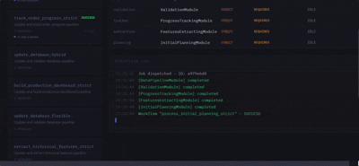
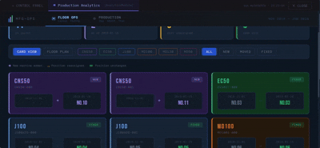
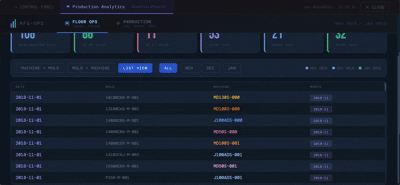

🌐 [English](README.md) | [Tiếng Việt](README-vi.md)

# OptiMoldIQ
**Workflow-driven production planning, analytics, and observability system for plastic molding operations.**

---

## Project Status

- **Current stable milestone:** **Milestone 05 – UI Release**
- **Next milestone:** Milestone 06 – Task Orchestration & Cloud Integration

Legend: ✅ Complete | 🔄 In Progress | 📝 Planned

---

## Overview

**OptiMoldIQ** is a module-based workflow orchestration system for manufacturing optimization. It wraps business agents as standardized modules, composes them into declarative workflows, and orchestrates execution with configurable dependency validation — designed for injection molding operations.

The system evolves through clearly defined milestones, prioritizing:
- Deterministic business logic
- Observability before optimization
- Backward-compatible system evolution

Milestone 05 introduces a browser-based control panel built with React + Vite, enabling non-technical users to trigger workflows, monitor execution, and explore analytics — without touching code. The panel is served directly by the FastAPI backend and accessible via a shareable URL.

---

## System Evolution

```
M01: Core Data Pipeline
↓
M02: Production Planning Workflow
↓
M03: Analytics & Dashboards (Framework-ready)
↓
M04: Framework Release
↓
M05: UI Release ← current
↓
M06: Task Orchestration & Cloud Integration
```

---

## Architecture Overview

OptiMoldIQ follows a **workflow-driven, module-based architecture**:

- **Modules** wrap business agents with a shared `BaseModule` contract
- **Workflows** are declarative JSON definitions — no code changes needed to reconfigure a pipeline
- **Dependency policies** (`strict` / `hybrid` / `flexible`) control how each module resolves its inputs
- **ModuleRegistry** combines Python class registration and YAML config into a single source of truth
- **Control Panel** is a React + Vite frontend served via FastAPI — no separate frontend server needed

```
OptiMoldIQ (Orchestration)
    └── WorkflowExecutor (Execution Engine)
            └── Modules (Business Logic) ← all inherit BaseModule
                    └── Shared Database / Filesystem

FastAPI (Backend + Static Server)
    └── control_panel_dist/ ← pre-built React UI
            └── Browser (Control Panel)
```

👉 Full architecture docs:
- [Architecture Overview](docs/v3/architecture/overview.md)
- [System Diagrams](docs/v3/architecture/diagrams)
- [BaseModule API](docs/v3/reference/base_module_api.md)
- [Workflow Schema](docs/v3/reference/workflow_schema.md)
- [Dependency Policies](docs/v3/reference/dependency_policies.md)
- [Module Registry](docs/v3/reference/module_registry.md)

---

## Quickstart

### Option A — Run via Google Colab (Recommended for non-technical users)

No local setup needed. Open the notebook and follow the steps:

👉 [Open in Google Colab](https://colab.research.google.com/github/ThuyHaLE/OptiMoldIQ/blob/main/control_panel_notebook.ipynb)

**Prerequisites:**
- A Google account
- A free ngrok account → get your authtoken at [dashboard.ngrok.com](https://dashboard.ngrok.com/get-started/your-authtoken)

The notebook will:
1. Clone the repository
2. Install all dependencies
3. Build the control panel UI
4. Launch the app and provide a shareable URL

---

### Option B — Run locally

```bash
git clone https://github.com/ThuyHaLE/OptiMoldIQ.git
cd OptiMoldIQ
pip install -r requirements.txt
pip install adjustText

# Build the control panel (requires Node.js)
cd control_panel
npm install
npm run build
cd ..

# Start the server
python main.py
```

Then open [http://localhost:8000](http://localhost:8000) in your browser.

---

### Option C — Run workflows via Python (no UI)

`dev_main.py` discovers and lists all available workflows, then runs `update_database_strict` as a demo.

To run a different workflow:

```python
result = orchestrator.execute("process_initial_planning")
```

To force re-execution without cache:

```python
result = orchestrator.execute("update_database_strict", clear_cache=True)
```

👉 [Full Getting Started guide](docs/v3/guides/getting_started.md)

---

## Repository Structure

```
OptiMoldIQ/
├── main.py                          # Entrypoint (API server + workflow demo)
├── configs/
│   ├── module_registry.yaml         # Central module config registry
│   ├── modules/                     # Per-module YAML configs
│   └── shared/
│       └── shared_source_config.py  # Shared path configuration
├── modules/                         # Business logic modules
├── optiMoldMaster/                  # Top-level orchestrator
├── workflows/
│   ├── definitions/                 # Workflow JSON definitions
│   ├── dependency_policies/         # strict / hybrid / flexible
│   ├── executor.py                  # Workflow execution engine
│   └── registry/                   # Module registry
├── api/                             # FastAPI routes & server
├── control_panel/                   # React + Vite source (npm run build)
├── control_panel_dist/              # Built UI — served by FastAPI
├── control_panel_notebook.ipynb     # Colab launcher notebook
└── requirements.txt
```

---

## Documentation

👉 [Full documentation index](docs/v3/README.md)

### For New Developers
1. [Getting Started](docs/v3/guides/getting_started.md)
2. [Demo — Output Format](docs/v3/demo/output_format)
3. [Architecture Overview](docs/v3/architecture/overview.md)

### For Module Developers
- [BaseModule API](docs/v3/reference/base_module_api.md)
- [Adding a Module](docs/v3/guides/adding_modules.md)
- [Configuration](docs/v3/guides/configuration.md)

### For Workflow Designers
- [Creating Workflows](docs/v3/guides/creating_workflows.md)
- [Workflow Schema](docs/v3/reference/workflow_schema.md)
- [Dependency Policies](docs/v3/reference/dependency_policies.md)
- [Adding a Dependency Policy](docs/v3/guides/adding_dependency_policy.md)

---

## Business Context

OptiMoldIQ addresses common challenges in plastic molding production:
- Fragmented operational data across shifts and machines
- Inefficient mold–machine utilization
- Limited observability across planning horizons

👉 [Business problem](docs/v2/OptiMoldIQ-business-problem.md) | [Problem-driven solution](docs/v2/OptiMoldIQ-problem_driven_solution.md)

---

## Milestones

### Milestone 01: Core Data Pipeline Agents (Completed July 2025)
> 👉 [Details](docs/v1/milestones/OptiMoldIQ-milestone_01.md)

### Milestone 02: Initial Production Planning System (Completed August 2025)
> 👉 [Details](docs/v1/milestones/OptiMoldIQ-milestone_02.md)

### Milestone 03: Enhanced Production Planning with Analytics and Dashboard System (Completed Jan 2026)
> 👉 [Details](docs/v2/milestones/OptiMoldIQ-milestone_03.md)

### Milestone 04: Framework Release (Completed Feb 2026)
> 👉 [Details](docs/v3/milestones/OptiMoldIQ-milestone_04.md)

### Milestone 05: UI Release (Completed Feb 2026)
> A browser-based control panel enabling non-technical users to interact with OptiMoldIQ workflows without code. Built with React + Vite, served via FastAPI, and deployable instantly via Google Colab + ngrok.
>
> **What's new:**
> - React + Vite control panel (`control_panel/`)
> - FastAPI static file serving from `control_panel_dist/`
> - Google Colab launcher notebook (`control_panel_notebook.ipynb`)
> - Workflow trigger, execution monitoring, and analytics views in the UI
>
> 👉 [Details](docs/v4/milestones/OptiMoldIQ-milestone_05.md)

---

## Demo & Visualization

**🌐 OptiMoldIQ Lite (Interactive Demo)**

Explore workflow stages and dashboards without running the full system.

> 👉 [See demo](https://thuyhale.github.io/OptiMoldIQ/)

**▶️ Control Panel Demo**

All workflows write results to the shared database. For workflows that include a visualization module (`ProgressTrackingModule`, `AnalyticsModule`, `InitialPlanningModule`), the control panel also surfaces an interactive output panel for quick exploration — directly in the UI, without leaving the app.

> **track_order_progress** — real-time progress tracking across orders and machines
> 

> **process_initial_planning** — generate and review the initial production plan
> 

> **analyze_production_records (overview)** — production analytics dashboard for machine layout change, mold-machine pair change
> 

> **analyze_production_records (detail)** — production analytics dashboard for day-month-year level
> 

---

## Contributing

Contributions are welcome!
1. Fork the repository
2. Create a feature branch
3. Submit a pull request

---

## License

This project is licensed under the MIT License. See [LICENSE](https://github.com/ThuyHaLE/OptiMoldIQ/blob/main/LICENSE) for details.

---

## Contact

- [Email](mailto:thuyha.le0590@gmail.com)
- [GitHub](https://github.com/ThuyHaLE)

*OptiMoldIQ is under continuous development — documentation and capabilities will expand with each milestone.*
