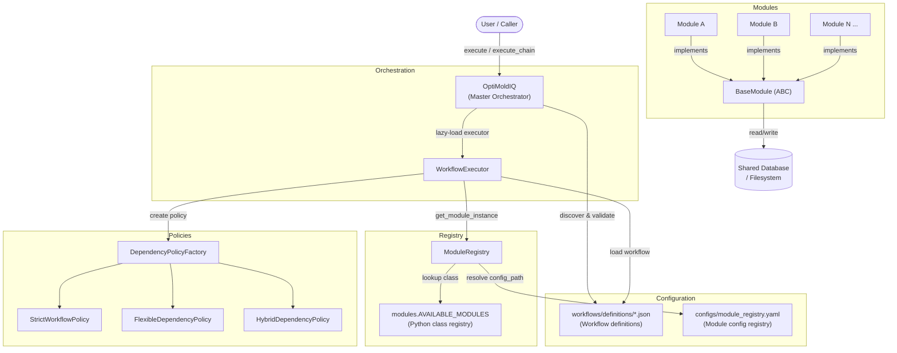
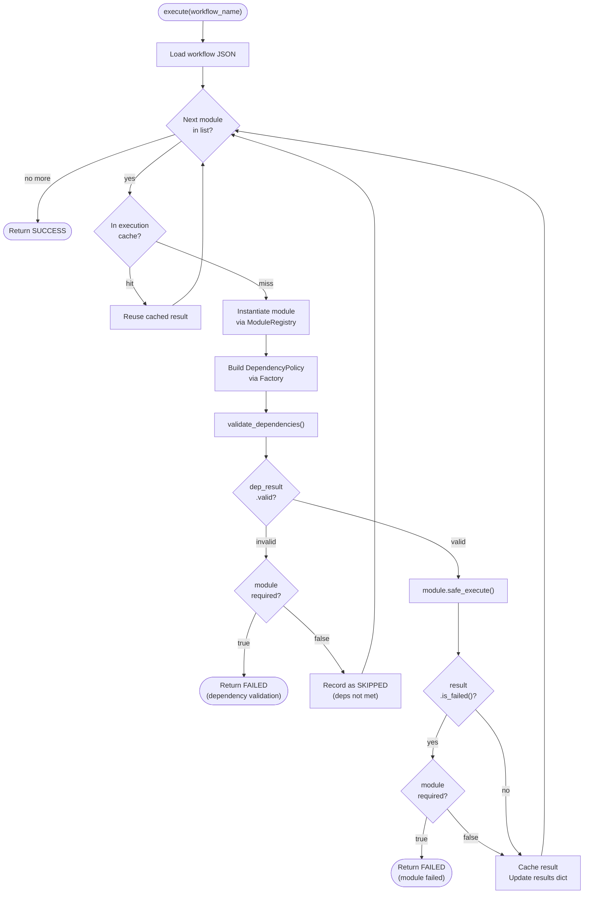
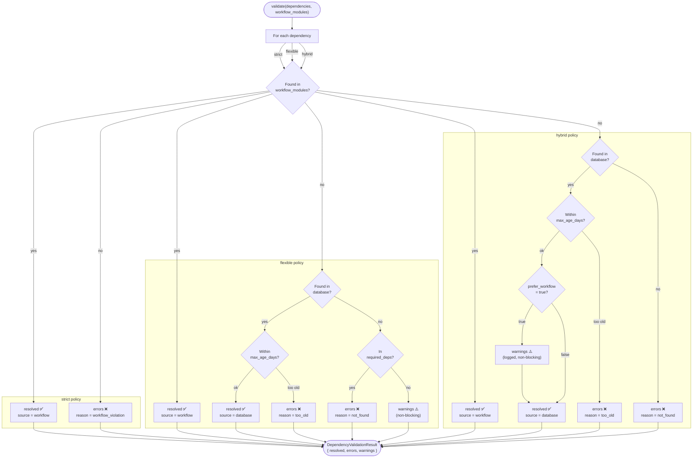
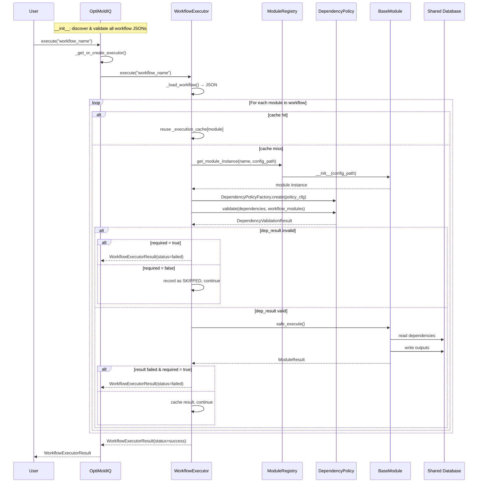
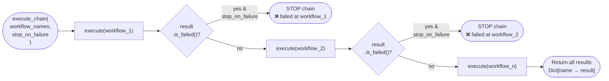

# System Diagrams

---

## 1. Architecture Overview — Component Diagram

---

## 2. Workflow Execution — Flow Diagram

---

## 3. Dependency Policy — Flow Diagram

---

## 4. OptiMoldIQ Orchestrator — Sequence Diagram

---

## 5. Workflow Chaining — Flow Diagram

