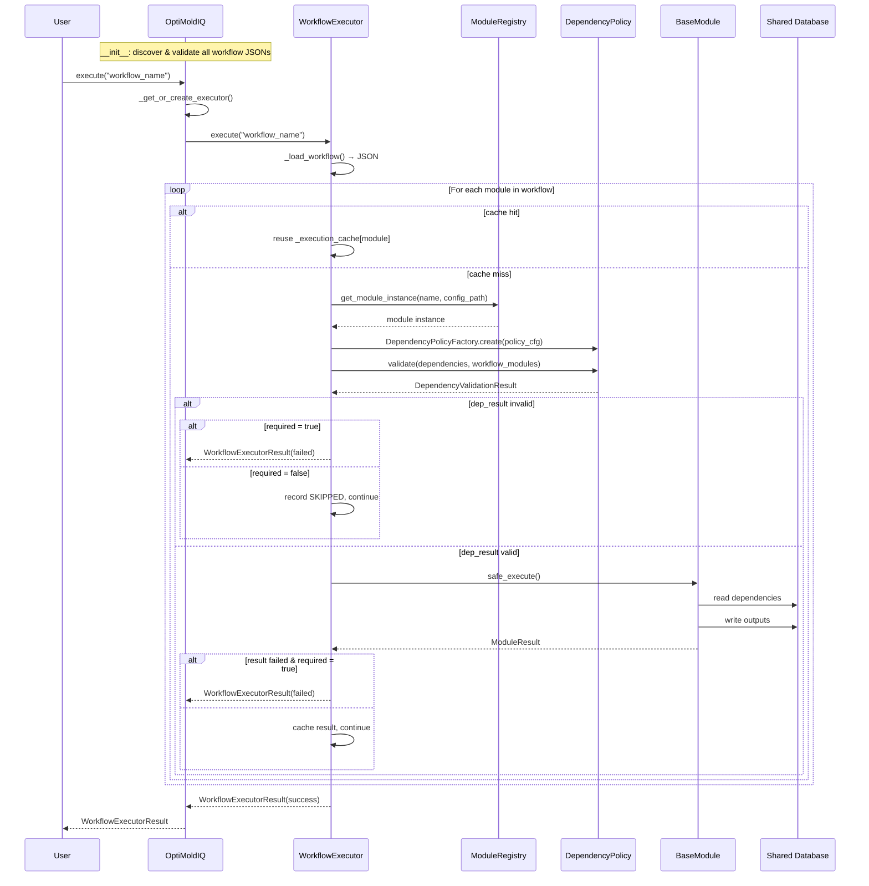

# OptiMoldIQ Architecture Documentation

## 📚 Table of Contents

1. [System Overview](#system-overview)
2. [Core Concepts](#core-concepts)
3. [Architecture Layers](#architecture-layers)
4. [Component Details](#component-details)
5. [Execution Flow](#execution-flow)
6. [Design Patterns](#design-patterns)
7. [Extension Guide](#extension-guide)
8. [Testing Strategy](#testing-strategy)

---

## System Overview

OptiMoldIQ is a **module-based workflow orchestration system** for manufacturing optimization. The system wraps business agents as standardized modules, composes them into declarative workflows, and orchestrates execution with configurable dependency validation.

### Key Design Principles

1. **Module-First Architecture** — All agents are wrapped as modules inheriting from `BaseModule`, enabling a shared contract for orchestration
2. **Declarative Workflows** — Workflows are defined in JSON and executed by the engine without code changes
3. **Config-Driven** — Each module has a YAML config that can be overridden at runtime, decoupling logic from configuration
4. **Policy-Based Dependency Validation** — Dependency resolution strategy is configurable per module per workflow
5. **Single Source of Truth** — `ModuleRegistry` combines Python class registration and YAML config into one interface

---

## Core Concepts

### 1. BaseModule — The Foundation

All modules inherit from `BaseModule`. This enforces a shared contract across all business agents:

```python
class BaseModule(ABC):
    DEFAULT_CONFIG_PATH: str = None  # fallback config path

    def __init__(self, config_path: Optional[str] = None):
        self.config = self.load_config(config_path)
        self.logger = logger.bind(module=self.module_name)

    @property
    @abstractmethod
    def module_name(self) -> str:
        """Unique module identifier"""

    @property
    def dependencies(self) -> Dict[str, str]:
        """dep_name -> resource_path mapping"""
        return {}

    @abstractmethod
    def execute(self) -> ModuleResult:
        """Main execution logic"""

    def safe_execute(self) -> ModuleResult:
        """Executor calls this — wraps execute() with error handling"""
```

**Why this matters:**
- ✅ Enforces consistent interface across all modules
- ✅ Allows generic orchestration without knowing module internals
- ✅ Simplifies testing with predictable behavior
- ✅ Config loading and logging handled once in base class

### 2. Module Registry — Single Source of Truth

The registry combines two sources: the **Python class registry** (what exists) and the **YAML config registry** (how it's configured):

```yaml
# configs/module_registry.yaml
DataPipelineModule:
  config_path: configs/modules/data_pipeline.yaml
  enabled: true

ValidationModule:
  config_path: configs/modules/validation.yaml
  enabled: true
```

`ModuleRegistry.get_module_instance()` resolves config in this order:
1. `override_config_path` if provided at call time
2. `config_path` from YAML registry
3. `None` → module uses `DEFAULT_CONFIG_PATH`

**Benefits:**
- 🎯 Enable/disable modules without code changes
- 🎯 Swap configs per environment (dev/staging/prod)
- 🎯 Modules still instantiable even without a YAML entry

### 3. Workflows — Declarative Composition

Workflows are JSON definitions that compose modules into an ordered execution plan:

```json
{
  "workflow_name": "update_database",
  "description": "Update and validate database pipeline",
  "modules": [
    {
      "module": "DataPipelineModule",
      "config_file": "configs/modules/data_pipeline.yaml",
      "dependency_policy": "strict",
      "required": true
    },
    {
      "module": "ValidationModule",
      "config_file": "configs/modules/validation.yaml",
      "dependency_policy": {
        "name": "hybrid",
        "params": { "max_age_days": 7 }
      },
      "required": false
    }
  ]
}
```

**Advantages:**
- 📝 Pipeline changes require no code modifications
- 📝 Version-controlled and reviewable
- 📝 Dependency policy configurable per module
- 📝 Validated at orchestrator init time — fail fast before execution

### 4. Dependency Policies — Flexible Validation

Policies control **where to look for a dependency** and **how old it can be**. Each module in a workflow can have its own policy.

| Policy | Looks in Workflow | Looks in Database | Use Case |
|--------|:-----------------:|:-----------------:|----------|
| `strict` | ✅ | ❌ | Production — all data must be from current run |
| `flexible` | ✅ | ✅ | Dev / partial re-runs — tolerates older data |
| `hybrid` | ✅ (preferred) | ✅ (fallback) | Production pipelines with partial re-execution |

Policies are created via `DependencyPolicyFactory.create()` and validated against `POLICY_SCHEMAS` before instantiation. See `dependency_policies.md` for full reference.

---

## Architecture Layers

```
┌─────────────────────────────────────────────────────────────┐
│                       OptiMoldIQ                            │
│                  (Orchestration Layer)                      │
│  - Auto-discover & validate workflow definitions            │
│  - Lazy-load executors per workflow                         │
│  - Workflow chaining with stop_on_failure                   │
│  - Execution cache management                               │
└──────────────────────┬──────────────────────────────────────┘
                       │
                       ▼
┌─────────────────────────────────────────────────────────────┐
│                  WorkflowExecutor                           │
│                  (Execution Engine)                         │
│  - Load workflow JSON                                       │
│  - Execute modules sequentially                             │
│  - Validate dependencies via policy before each execute     │
│  - Handle required / optional module logic                  │
│  - Cache results within a run                               │
└──────────────────────┬──────────────────────────────────────┘
                       │
                       ▼
┌─────────────────────────────────────────────────────────────┐
│                    Module Layer                             │
│                  (Business Logic)                           │
│  ┌─────────────┐  ┌─────────────┐  ┌─────────────┐          │
│  │  Pipeline   │  │  Analytics  │  │  Dashboard  │  ...     │  
│  │  Module     │  │  Module     │  │  Module     │          │
│  └─────────────┘  └─────────────┘  └─────────────┘          │
│                All inherit from BaseModule                  │
└──────────────────────┬──────────────────────────────────────┘
                       │
                       ▼
┌─────────────────────────────────────────────────────────────┐
│                  Foundation Layer                           │
│  ┌──────────────┐  ┌──────────────┐  ┌──────────────────┐   │
│  │  BaseModule  │  │   Module     │  │   Dependency     │   │
│  │   (ABC)      │  │   Registry   │  │   Policies       │   │
│  └──────────────┘  └──────────────┘  └──────────────────┘   │
└─────────────────────────────────────────────────────────────┘
                       │
                       ▼
              ┌────────────────┐
              │ Shared Database│
              │ / Filesystem   │
              └────────────────┘
```

### Layer Responsibilities

#### Foundation Layer
- **BaseModule** — abstract contract: `module_name`, `dependencies`, `execute()`, `safe_execute()`
- **ModuleRegistry** — resolves module class + config path from `AVAILABLE_MODULES` and YAML
- **DependencyPolicies** — `strict` / `flexible` / `hybrid` with schema validation via `DependencyPolicyFactory`

#### Module Layer
- Concrete business logic implementations
- Each module reads from and writes to the shared database/filesystem
- Modules declare `dependencies` as `dep_name -> resource_path` but do not manage resolution themselves
- `execute()` returns only metadata/summary in `ModuleResult.data` — full data lives in the database

#### Execution Engine (WorkflowExecutor)
- Loads workflow JSON sequentially
- For each module: instantiate → build policy → validate deps → `safe_execute()`
- `required: true` → stop workflow on failure; `required: false` → skip and continue
- Caches `ModuleResult` per module name within an executor instance

#### Orchestration Layer (OptiMoldIQ)
- Auto-discovers `workflows/definitions/*.json` on init and validates each definition
- Lazy-loads one `WorkflowExecutor` per workflow type (reuses execution cache)
- `execute_chain()` runs multiple workflows in sequence with configurable `stop_on_failure`
- `clear_cache=True` forces fresh execution by clearing the executor's result cache

---

## Component Details

### Directory Structure

```
OptiMoldIQ/
├── configs/
│   ├── module_registry.yaml          # Central module config registry
│   ├── modules/
│   │   ├── analytics.yaml
│   │   ├── dashboard.yaml
│   │   ├── data_pipeline.yaml
│   │   ├── features_extracting.yaml
│   │   ├── initial_planning.yaml
│   │   ├── progress_tracking.yaml
│   │   └── validation.yaml
│   └── shared/
│       └── shared_source_config.py
├── main.py
├── modules/
│   ├── __init__.py                   # AVAILABLE_MODULES registry + get_module()
│   ├── base_module.py                # BaseModule ABC + ModuleResult
│   ├── analytics_module.py
│   ├── dashboard_module.py
│   ├── data_pipeline_module.py
│   ├── features_extracting_module.py
│   ├── initial_planning_module.py
│   ├── progress_tracking_module.py
│   └── validation_module.py
├── optiMoldMaster/
│   └── opti_mold_master.py           # OptiMoldIQ orchestrator
├── requirements.txt
└── workflows/
    ├── definitions/                  # JSON workflow definitions
    │   ├── analyze_production_records.json
    │   ├── build_production_dashboard.json
    │   ├── extract_historical_features.json
    │   ├── process_initial_planning.json
    │   ├── track_order_progress.json
    │   ├── update_database_flexible.json
    │   ├── update_database_hybrid.json
    │   └── update_database_strict.json
    ├── dependency_policies/
    │   ├── __init__.py               # POLICY_SCHEMAS + AVAILABLE_POLICIES
    │   ├── base.py                   # DependencyPolicy ABC + DependencyValidationResult
    │   ├── factory.py                # DependencyPolicyFactory
    │   ├── flexible.py
    │   ├── hybrid.py
    │   └── strict.py
    ├── executor.py                   # WorkflowExecutor
    └── registry/
        └── registry.py              # ModuleRegistry
```

### Key Files

#### ⭐ `modules/base_module.py`
The foundation all modules must inherit from. Defines `module_name`, `dependencies`, `execute()`, `safe_execute()`, `load_config()`, and `ModuleResult`.

#### ⭐ `modules/__init__.py`
Maintains `AVAILABLE_MODULES: Dict[str, Type[BaseModule]]` and `get_module(name)` factory function. Any new module must be registered here.

#### ⭐ `workflows/executor.py`
Sequential execution engine. Reads workflow JSON, instantiates modules via `ModuleRegistry`, validates dependencies via `DependencyPolicyFactory`, calls `safe_execute()`, and caches results.

#### ⭐ `workflows/dependency_policies/__init__.py`
`POLICY_SCHEMAS` defines the contract for each policy (required params, optional params with types and defaults). `DependencyPolicyFactory` validates configs against these schemas before instantiation.

#### ⭐ `optiMoldMaster/opti_mold_master.py`
Top-level orchestrator. Discovers and validates all workflow JSONs at init. Provides `execute()`, `execute_chain()`, and cache management.

---

## Execution Flow



---

## Design Patterns

### Strategy Pattern
**Used in**: Dependency policies

```python
# Same interface, different validation behavior
policy = DependencyPolicyFactory.create("strict")
policy = DependencyPolicyFactory.create({"name": "hybrid", "params": {"max_age_days": 7}})

result = policy.validate(dependencies, workflow_modules)
```

### Template Method Pattern
**Used in**: `BaseModule.safe_execute()`

```python
class BaseModule:
    def safe_execute(self) -> ModuleResult:
        """Fixed flow — subclass only implements execute()"""
        try:
            result = self.execute()
            ...
        except Exception as e:
            return ModuleResult(status='failed', errors=[str(e)])
```

### Registry Pattern
**Used in**: Module discovery and instantiation

```python
# Two-layer registry: Python class + YAML config
registry = ModuleRegistry()
module = registry.get_module_instance("DataPipelineModule")

# Or with runtime override
module = registry.get_module_instance(
    "DataPipelineModule",
    override_config_path="configs/modules/data_pipeline_dev.yaml"
)
```

### Factory Pattern with Schema Validation
**Used in**: `DependencyPolicyFactory`

```python
# Validates params against POLICY_SCHEMAS before instantiation
policy = DependencyPolicyFactory.create({
    "name": "flexible",
    "params": {"max_age_days": 7}
})
# → raises ValueError immediately if params are invalid
```

---

## Extension Guide

### Adding a New Module

See [Adding a New Module](docs/v3/guides/adding_modules.md) for the step-by-step guide.

**Summary:**
1. Create class in `modules/` inheriting `BaseModule`
2. Register in `modules/__init__.py` → `AVAILABLE_MODULES`
3. Add YAML entry in `configs/module_registry.yaml`
4. Create config file in `configs/modules/`
5. Use in a workflow JSON

### Adding a New Workflow

Create a JSON file in `workflows/definitions/`. It will be auto-discovered and validated by `OptiMoldIQ` on next init.

See [Workflow JSON Schema](docs/v3/reference/workflow_schema.md) for the full schema reference.

### Adding a New Dependency Policy

See [Adding a New Dependency Policy](docs/v3/guides/adding_dependency_policy.md) for the step-by-step guide.

**Summary:**
1. Create class in `workflows/dependency_policies/` inheriting `DependencyPolicy`
2. Register in `workflows/dependency_policies/__init__.py` → `POLICY_SCHEMAS` and `AVAILABLE_POLICIES`

---

## Testing Strategy

### Test Architecture

```
modules/base_module.py  →  tests/modules_tests/test_modules_auto.py
                        →  tests/modules_tests/test_dependency_visualization.py
                        →  tests/modules_tests/conftest.py
```

### Test Levels

**Unit Tests** — module in isolation, no real dependencies:
```python
def test_module_creation(module_fixture_factory):
    module = module_fixture_factory('DataPipelineModule')
    assert module is not None
```

**Integration Tests** — with real upstream dependencies executed:
```python
def test_module_with_real_dependencies(module_context_factory):
    context = module_context_factory('ValidationModule')
    # DataPipelineModule was executed and result is available
```

**Workflow Tests** — full end-to-end execution:
```python
def test_full_pipeline_execution(module_dependency_executor):
    result = executor.execute("update_database")
    assert result.is_success()
```

### Test Coverage

| **Component**                             | Stmts | Miss  | Coverage |
| ----------------------------------------- | ----- | ----- | -------- |
| modules/__init__.py                       |  17   |    5  |   71%    |
| modules/analytics_module.py               |  55   |    9  |   84%    |
| modules/base_module.py                    |  68   |   13  |   81%    |
| modules/dashboard_module.py               |  55   |    9  |   84%    |
| modules/data_pipeline_module.py           |  46   |    8  |   83%    |
| modules/features_extracting_module.py     |  57   |   10  |   82%    |
| modules/initial_planning_module.py        |  57   |   10  |   82%    |
| modules/progress_tracking_module.py       |  47   |    9  |   81%    |
| modules/validation_module.py              |  49   |    9  |   82%    |
| **TOTAL**                                 | 451   |   82  |   82%    |

> *90 passed, 1 skipped — 187s*

---

## Future Enhancements

1. **Per-module retry policy** — `max_retries`, `retry_delay`
2. **Healing hooks** — `on_failure: notify | retry | fallback_module`
3. **Conditional branching** — execute based on output of previous module
4. **Parallel execution** — run independent modules concurrently
5. **Workflow versioning** — track definition changes over time

---

## Glossary

| Term | Definition |
|------|------------|
| **BaseModule** | Abstract base class all modules inherit from |
| **Module** | A business agent wrapped with the BaseModule contract |
| **Workflow** | Ordered JSON composition of modules with per-module policy config |
| **ModuleRegistry** | Combines `AVAILABLE_MODULES` (Python) and `module_registry.yaml` (config) |
| **Dependency Policy** | Strategy controlling where and how dependencies are validated before execution |
| **DependencyValidationResult** | Contract between policy and executor: `resolved`, `errors`, `warnings` |
| **ModuleResult** | Standardized output from module execution: `status`, `data`, `message`, `errors` |
| **Execution Cache** | Per-executor cache of `ModuleResult` keyed by module name — reused across calls |
| **AVAILABLE_MODULES** | Python dict mapping module name → class, defined in `modules/__init__.py` |
| **POLICY_SCHEMAS** | Schema definitions for each policy, used for param validation at factory time |

---

**Document Version**: 2.0
**Last Updated**: February 2026
**Maintained By**: Development Team