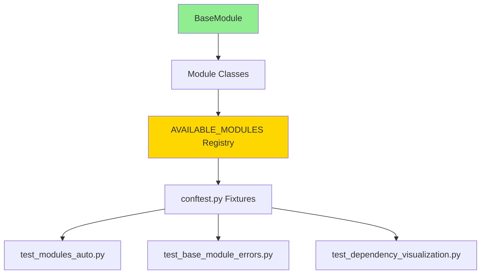

# Module Test Suite Documentation

## 📚 Table of Contents

1. [Overview](#overview)
2. [Test Suite Structure](#test-suite-structure)
3. [File Descriptions](#file-descriptions)
4. [Running Tests](#running-tests)
5. [Test Coverage](#test-coverage)
6. [Troubleshooting](#troubleshooting)
7. [Best Practices](#best-practices)

---

## Overview

This test suite validates all modules that inherit from `BaseModule`. It uses **real dependency execution against the shared database** — no mocking.

- **Auto-discovery** — all modules in `AVAILABLE_MODULES` are tested automatically via pytest parametrization
- **Real execution** — modules read/write to the shared filesystem as they would in production
- **Dependency chaining** — `TestModuleDependencyExecutor` resolves and executes dependency chains in correct order
- **82% code coverage** across all modules

### Current Test Results

```
================================ tests coverage ================================
Name                                    Stmts   Miss  Cover   Missing
---------------------------------------------------------------------
modules/__init__.py                        17      5    71%   34-38, 43
modules/analytics_module.py                55      9    84%   27, 65, 76, 140-141, 150, 166-169
modules/base_module.py                     68     13    81%   54-57, 69-70, 79-81, 100, 106, 117, 131
modules/dashboard_module.py                55      9    84%   27, 66, 77, 142-143, 152, 168-171
modules/data_pipeline_module.py            46      8    83%   33, 46, 92-93, 102, 118-121
modules/features_extracting_module.py      57     10    82%   27, 44, 51, 62, 134-135, 144, 160-163
modules/initial_planning_module.py         57     10    82%   27, 44, 51, 62, 127-128, 137, 153-156
modules/progress_tracking_module.py        47      9    81%   33-34, 49, 98-99, 108, 124-127
modules/validation_module.py               49      9    82%   26, 35, 46, 99-100, 109, 125-128
---------------------------------------------------------------------
TOTAL                                     451     82    82%
======= 90 passed, 1 skipped, 1 deselected, 1 warning in 187.27s =======
```

---

## Test Suite Structure

```
tests/modules_tests/
├── conftest.py                          # Fixtures & dependency management
├── test_modules_auto.py                 # Main automated test suite
├── test_base_module_errors.py           # BaseModule error handling tests
└── test_dependency_visualization.py     # Visualization & analysis
```

### Dependency Flow



---

## File Descriptions

### 1. `conftest.py` — Test Infrastructure

Provides session-scoped fixtures and the test-only dependency executor.

#### Fixtures

| Fixture | Scope | Returns | Description |
|---|---|---|---|
| `module_registry` | session | `Dict` | Loads `configs/module_registry.yaml` |
| `available_modules` | session | `Dict` | Returns `AVAILABLE_MODULES` from `modules/__init__.py` |
| `enabled_modules` | session | `List[Tuple]` | Modules where `enabled: true` in registry |
| `module_dependency_graph` | session | `ModuleDependencyGraph` | Dependency graph resolver |
| `module_dependency_executor` | session | `TestModuleDependencyExecutor` | Test-only executor |
| `module_fixture_factory` | function | `Callable` | Creates module instances |
| `module_context_factory` | function | `Callable` | Executes dependencies and returns results |
| `assert_module_success` | function | `Callable` | Asserts `ModuleResult.status == "success"` |
| `create_empty_context` | function | `Callable` | Deprecated — kept for backward compat |
| `print_dependency_graph` | function | `Callable` | Debug helper for dependency chains |

#### `ModuleDependencyGraph`

Resolves execution order using DFS with cycle detection.

```python
graph = ModuleDependencyGraph(module_registry, available_modules)

# Get ordered execution list (dependencies first)
order = graph.get_execution_order('AnalyticsModule')
# → ['DataPipelineModule', 'AnalyticsModule']

# Get all transitive dependencies (excludes the module itself)
deps = graph.get_all_dependencies('AnalyticsModule')
# → {'DataPipelineModule'}

# Check for any circular dependencies across all modules
graph.has_circular_dependencies()  # → False
```

Raises `ValueError` with the full cycle path if circular dependency is detected.

#### `TestModuleDependencyExecutor`

Test-only executor — **not** `WorkflowExecutor`. Executes modules with real dependencies and caches results within the session.

```python
executor = TestModuleDependencyExecutor(module_registry, available_modules)

# Execute module and all its dependencies
results = executor.execute_with_dependencies('AnalyticsModule')
# → {'DataPipelineModule': ModuleResult, 'AnalyticsModule': ModuleResult}

# Get only dependency results (does NOT execute the module itself)
context = executor.get_context_for_module('AnalyticsModule')
# → {'DataPipelineModule': ModuleResult}

# Clear cache between test runs
executor.clear_cache()
```

> **Note:** `safe_execute()` takes no parameters — modules read from the shared database directly. The `context` dict is used in tests only to verify dependency results, not passed to `execute()`.

---

### 2. `test_modules_auto.py` — Main Test Suite

Automatically tests all modules via pytest parametrization. Every module in `AVAILABLE_MODULES` becomes a separate test case.

#### `TestModulesAutomatically` — Unit Tests

| Test | Markers | What it checks |
|---|---|---|
| `test_module_creation` | `smoke`, `no_dependencies` | Module can be instantiated |
| `test_module_config_loading` | `no_dependencies` | YAML config loads correctly |
| `test_module_dependency_declaration` | — | `dependencies` returns `Dict[str, str]` |
| `test_dependency_audit_removed` | — | `safe_execute()` runs without parameters and returns valid status |
| `test_module_interface_compliance` | `smoke`, `no_dependencies` | Implements `BaseModule` interface |

#### `TestModulesWithDependencies` — Integration Tests

| Test | Markers | What it checks |
|---|---|---|
| `test_module_with_real_dependencies` | `requires_dependencies` | All declared dependencies execute successfully |
| `test_module_execution_with_dependencies` | `requires_dependencies` | Full end-to-end execution after deps are satisfied |

#### `TestModuleDependencyGraph` — Graph Tests

| Test | Markers | What it checks |
|---|---|---|
| `test_dependency_graph_resolution` | `no_dependencies` | Correct execution order, deps appear before module |
| `test_circular_dependency_detection` | — | No duplicates in execution order |

#### `TestModulesWithoutDependencies` — Standalone Tests

| Test | Markers | What it checks |
|---|---|---|
| `test_modules_without_dependencies` | `no_dependencies` | Entry-point modules run independently |

#### `TestModulesComprehensive` — Full Pipeline

| Test | Markers | What it checks |
|---|---|---|
| `test_full_pipeline_execution` | `integration` | All enabled modules execute in dependency order |

---

### 3. `test_base_module_errors.py` — Error Handling Tests

Tests error paths in `BaseModule` that are not covered by the auto-discovery suite.

#### `TestBaseModuleErrorHandling`

| Test | What it checks |
|---|---|
| `test_execute_without_parameters` | `safe_execute()` runs with no args |
| `test_execute_with_exception` | `safe_execute()` catches exception → `status='failed'` |
| `test_module_result_status_methods` | `is_success()`, `is_failed()`, `is_skipped()` |
| `test_execute_returns_module_result` | Return type is always `ModuleResult` |
| `test_error_message_in_result` | Exception message captured in `result.message` and `result.errors` |
| `test_logger_binding` | Logger is bound with module context |
| `test_multiple_executions` | Module can be executed more than once |
| `test_config_loading_error_handling` | Non-existent config → empty `{}`, no exception |
| `test_safe_execute_logs_correctly` | Logs are emitted during execution |

#### `TestModuleResultDataclass`

| Test | What it checks |
|---|---|
| `test_module_result_creation_minimal` | Minimal fields (`status`, `data`, `message`) |
| `test_module_result_creation_full` | All fields including `errors` |
| `test_module_result_is_dataclass` | `is_dataclass(ModuleResult)` |
| `test_module_result_equality` | Dataclass equality comparison |
| `test_module_result_status_values` | Valid status strings: `success`, `failed`, `skipped` |

#### `TestBaseModuleDependencies`

| Test | What it checks |
|---|---|
| `test_dependencies_property_exists` | Property exists and returns `dict` |
| `test_dependencies_are_strings` | Keys and values are both `str` |
| `test_module_name_property` | Property exists, returns non-empty `str` |

---

### 4. `test_dependency_visualization.py` — Analysis & Visualization

Outputs are printed to console (`-s` flag required to see them). All tests are marked `smoke`.

#### `TestDependencyVisualization`

| Test | Output |
|---|---|
| `test_print_all_module_dependencies` | Full module list with dependency paths |
| `test_print_execution_orders` | Execution chain per module |
| `test_analyze_dependency_depth` | Depth stats (entry points, max, avg) |
| `test_find_dependency_patterns` | Most depended-upon modules |
| `test_check_for_orphan_modules` | Modules with no dependents |
| `test_visualize_circular_dependencies` | Cycle detection — asserts 0 cycles |

#### `TestDependencyIntegrity`

| Test | Asserts |
|---|---|
| `test_all_dependencies_exist` | All `dependencies` keys point to real modules |
| `test_no_self_dependencies` | No module lists itself as a dependency |
| `test_dependency_types` | `dependencies` is `Dict[str, str]`, no `None` values |

#### `TestDependencyExport`

| Test | Output |
|---|---|
| `test_export_dependency_graph_json` | `dependency_graph.json` with full graph + metadata |
| `test_export_mermaid_diagram` | `dependency_graph.mmd` — renderable Mermaid diagram |

#### `TestArchitectureValidation`

Validates architecture-level constraints:
- All modules inherit from `BaseModule`
- No circular dependencies
- At least one entry point exists
- Max dependency depth < 10

---

## Running Tests

### Common Commands

```bash
# Full test suite
pytest tests/modules_tests/ -v

# See printed output (visualization tests)
pytest tests/modules_tests/ -v -s

# By marker
pytest tests/modules_tests/ -m smoke -v
pytest tests/modules_tests/ -m no_dependencies -v
pytest tests/modules_tests/ -m requires_dependencies -v
pytest tests/modules_tests/ -m integration -v

# Specific module
pytest tests/modules_tests/ -k "DataPipelineModule" -v

# With coverage
pytest tests/modules_tests/ --cov=modules --cov-report=term-missing
pytest tests/modules_tests/ --cov=modules --cov-report=html

# Stop on first failure
pytest tests/modules_tests/ -x

# Parallel execution
pytest tests/modules_tests/ -n auto
```

### Test Markers

| Marker | Typical Runtime | Use Case |
|---|---|---|
| `smoke` | < 5s | Fast validation, CI gatekeeping |
| `no_dependencies` | < 30s | Unit tests, no real execution |
| `requires_dependencies` | 30s – 2min | Integration, real DB execution |
| `integration` | > 2min | Full pipeline end-to-end |

---

## Test Coverage

### Current: 82% (451 stmts, 82 missed)

| Module | Coverage | Uncovered Lines |
|---|---|---|
| `analytics_module.py` | 84% | 27, 65, 76, 140-141, 150, 166-169 |
| `dashboard_module.py` | 84% | 27, 66, 77, 142-143, 152, 168-171 |
| `data_pipeline_module.py` | 83% | 33, 46, 92-93, 102, 118-121 |
| `validation_module.py` | 82% | 26, 35, 46, 99-100, 109, 125-128 |
| `features_extracting_module.py` | 82% | 27, 44, 51, 62, 134-135, 144, 160-163 |
| `initial_planning_module.py` | 82% | 27, 44, 51, 62, 127-128, 137, 153-156 |
| `progress_tracking_module.py` | 81% | 33-34, 49, 98-99, 108, 124-127 |
| `base_module.py` | 81% | 54-57, 69-70, 79-81, 100, 106, 117, 131 |
| `modules/__init__.py` | 71% | 34-38, 43 |

### Where the gaps are

**`base_module.py` (81%)** — Lines 54–57 are the `DEFAULT_CONFIG_PATH` fallback in `load_config()` (triggered when provided config doesn't exist). Lines 69–70 and 79–81 are exception paths. These are now partially covered by `test_base_module_errors.py`.

**`modules/__init__.py` (71%)** — Lines 34–38 and 43 are the `ValueError` branch in `get_module()` when a name is not in `AVAILABLE_MODULES`. A single negative test case would cover these.

**Individual modules (81–84%)** — The uncovered lines across all modules follow the same pattern: early-return guards (line ~27–46) and exception paths at the end of `execute()` (lines ~118–169). Adding `monkeypatch` tests that force these exception paths would push coverage to ~90%.

---

## Troubleshooting

### Module not found in registry

```
pytest.skip.Exception: Module YourModule not in registry
```

Add an entry to `configs/module_registry.yaml`:
```yaml
YourModule:
  config_path: configs/modules/your_module.yaml
  enabled: true
```

---

### Circular dependency detected

```
ValueError: Circular dependency detected: ModuleA → ModuleB → ModuleA
```

Run to identify the cycle:
```bash
pytest tests/modules_tests/test_dependency_visualization.py::TestDependencyVisualization::test_visualize_circular_dependencies -v -s
```

Then fix the `dependencies` property on the offending module.

---

### Config file not found

```
pytest.skip.Exception: Config file not found: configs/modules/your_module.yaml
```

Create the config file at the path declared in `module_registry.yaml`. Minimum content:
```yaml
module_name: "YourModule"
enabled: true
```

---

### Dependency execution failed

```
AssertionError: Dependency DataPipelineModule failed: ...
```

The upstream module is failing. Isolate it first:
```bash
pytest tests/modules_tests/ -k "DataPipelineModule and test_module_creation" -v -s
```

---

## Best Practices

### When adding a new module

1. Inherit from `BaseModule`, implement `module_name` and `execute()`
2. Register in `modules/__init__.py` → `AVAILABLE_MODULES`
3. Add entry to `configs/module_registry.yaml`
4. Create `configs/modules/your_module.yaml`
5. Run `pytest tests/modules_tests/ -k "YourModule" -v` to verify auto-discovery picks it up
6. Run the full suite to check for regressions

### When modifying `BaseModule`

1. Update abstract methods / properties in `base_module.py`
2. Update interface compliance test in `test_modules_auto.py::test_module_interface_compliance`
3. Update `conftest.py` if execution model changes (e.g. `safe_execute()` signature)
4. Update all concrete module implementations
5. Update this document — especially the BaseModule contract section

### execute() has no parameters

`safe_execute()` and `execute()` take **no parameters**. Modules read their dependencies from the shared database/filesystem using the paths declared in `dependencies`. The `context` dict in tests is used only to verify that upstream modules completed successfully — it is never passed to the module.

```python
# ✅ Correct
result = module.safe_execute()

# ❌ Wrong — execute() does not accept context
result = module.safe_execute(context)
```

---

**Document Version**: 2.0
**Last Updated**: February 2026
**Test Framework**: pytest 7.x
**Python Version**: 3.11+