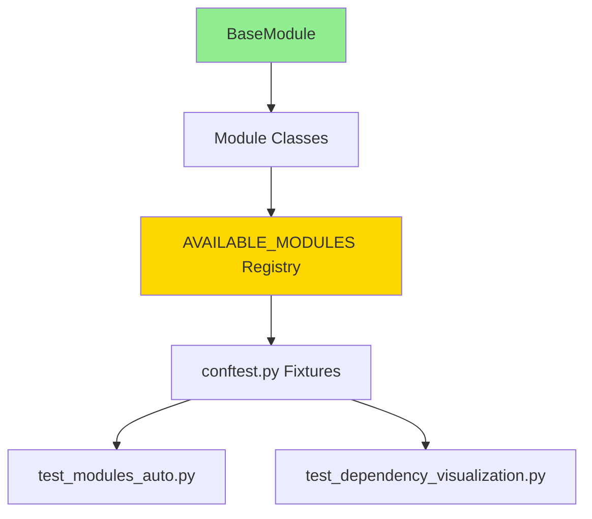
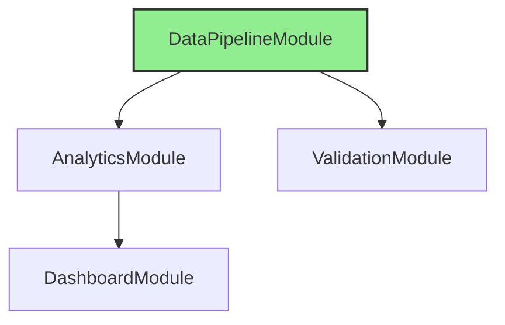
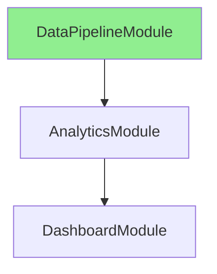
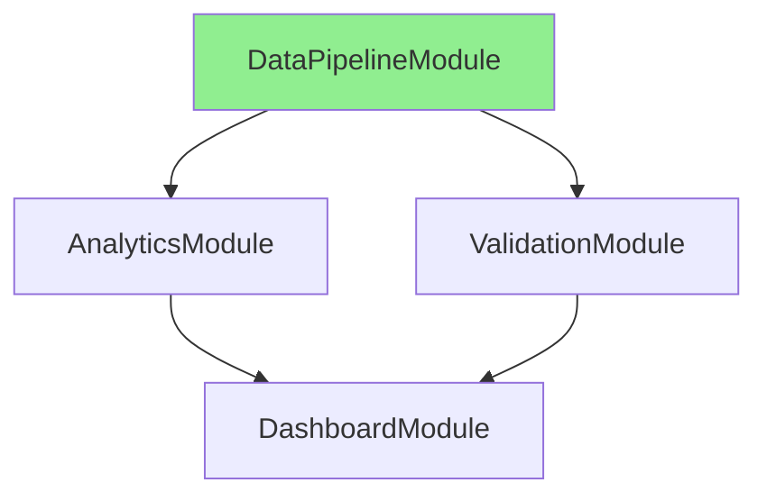
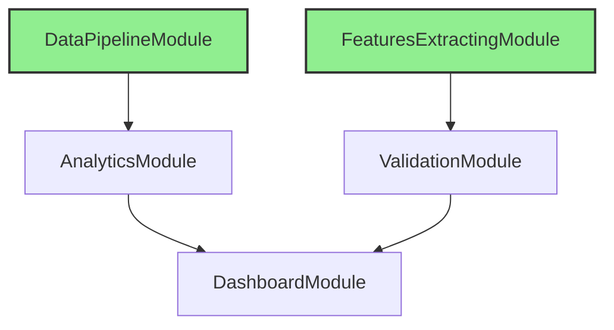

# Module Test Suite Documentation

## 📚 Table of Contents

1. [Overview](#overview)
2. [Architecture Foundation](#architecture-foundation)
3. [Test Suite Structure](#test-suite-structure)
4. [File Descriptions](#file-descriptions)
5. [BaseModule Contract](#basemodule-contract)
6. [Updating Tests When BaseModule Changes](#updating-tests-when-basemodule-changes)
7. [Running Tests](#running-tests)
8. [Test Coverage Analysis](#test-coverage-analysis)
9. [Troubleshooting](#troubleshooting)
10. [Best Practices](#best-practices)

---

## Overview

This test suite validates all modules that inherit from `BaseModule`. It provides:

- ✅ **Automated discovery** - All modules in `AVAILABLE_MODULES` are tested automatically
- ✅ **Real dependency execution** - Uses shared database (no mocking)
- ✅ **Comprehensive validation** - Tests creation, config loading, dependencies, execution
- ✅ **Architecture visualization** - Exports dependency graphs and analysis
- ✅ **Integration testing** - Full pipeline execution with real dependencies
- ✅ **82% Code Coverage** - High test coverage across all modules

### Current Test Results

```
================================ tests coverage ================================
_______________ coverage: platform linux, python 3.11.14-final-0 _______________
Name                                    Stmts   Miss  Cover   Missing
---------------------------------------------------------------------
modules/__init__.py                        18      6    67%   34-39, 44
modules/analytics_module.py                59      9    85%   28, 66, 77, 156-157, 166, 186-189
modules/base_module.py                     79     22    72%   23, 26, 55-58, 64-71, 80-82, 104, 110, 121, 130, 152, 155
modules/dashboard_module.py                59      9    85%   28, 67, 78, 158-159, 168, 188-191
modules/data_pipeline_module.py            44      5    89%   34, 47, 117-119
modules/features_extracting_module.py      68      9    87%   31, 62, 73, 164-165, 174, 194-197
modules/initial_planning_module.py         57      9    84%   30, 49, 60, 134-135, 144, 164-167
modules/progress_tracking_module.py        51      9    82%   34-35, 50, 110-111, 120, 140-143
modules/validation_module.py               53      9    83%   27, 36, 47, 113-114, 123, 145-148
---------------------------------------------------------------------
TOTAL                                     488     87    82%
Coverage XML written to file coverage.xml
====== 76 passed, 2 skipped, 1 deselected, 1 warning in 162.08s (0:02:42) ======
```

---

## Architecture Foundation

### The BaseModule Contract

**Every module MUST inherit from `BaseModule` and implement:**

```python
from modules.base_module import BaseModule, ModuleResult

class YourModule(BaseModule):
    
    # REQUIRED: Unique module identifier
    @property
    def module_name(self) -> str:
        return "YourModule"
    
    # REQUIRED: Main execution logic
    def execute(self, context: Dict[str, ModuleResult]) -> ModuleResult:
        # Your logic here
        return ModuleResult(
            status='success',  # 'success' | 'failed' | 'skipped'
            data=your_data,
            message="Execution completed",
            context_updates={'output_key': value}
        )
    
    # OPTIONAL: Declare dependencies (default: {})
    @property
    def dependencies(self) -> Dict[str, str]:
        return {
            'OtherModule': './path/to/expected/output.json'
        }
    
    # OPTIONAL: Declare context outputs (default: [])
    @property
    def context_outputs(self) -> List[str]:
        return ['output_key1', 'output_key2']
```

### Key Principles

1. **All modules inherit from `BaseModule`** - This is mandatory
2. **Dependencies are declarative** - Via `dependencies` property
3. **Execution is standardized** - Via `execute()` and `safe_execute()`
4. **Results are uniform** - Always return `ModuleResult`
5. **Context is shared** - All modules read/write to context dict
6. **No storage APIs** - Modules use file system and database, not browser storage

---

## Test Suite Structure

```
tests/modules_tests/
├── conftest.py                          # Fixtures & dependency management
├── test_modules_auto.py                 # Main automated test suite
└── test_dependency_visualization.py     # Visualization & analysis
```

### Dependency Flow



---

## File Descriptions

### 1. `conftest.py` - Test Infrastructure

**Purpose**: Provides fixtures and utilities for module testing

**Key Components**:

| Component | Type | Description |
|-----------|------|-------------|
| `module_registry` | Fixture | Loads `module_registry.yaml` (session-scoped) |
| `available_modules` | Fixture | Returns `AVAILABLE_MODULES` dict |
| `enabled_modules` | Fixture | Returns only enabled modules from registry |
| `module_dependency_graph` | Fixture | Provides `ModuleDependencyGraph` instance |
| `module_dependency_executor` | Fixture | Provides `TestModuleDependencyExecutor` instance |
| `module_fixture_factory` | Fixture | Creates module instances for testing |
| `module_context_factory` | Fixture | Gets context with dependencies executed |
| `assert_module_success` | Fixture | Helper to assert successful execution |
| `create_empty_context` | Fixture | Creates empty context for modules without deps |
| `print_dependency_graph` | Fixture | Debug helper to print dependency graphs |

**Important Classes**:

#### `TestModuleDependencyExecutor`
Simplified executor for testing modules with real dependency execution:

```python
executor = TestModuleDependencyExecutor(module_registry, available_modules)

# Execute module and all its dependencies
context = executor.execute_with_dependencies('AnalyticsModule')

# Get only context for a module (execute only dependencies)
context = executor.get_context_for_module('AnalyticsModule')

# Clear execution cache between tests
executor.clear_cache()
```

**Example Usage**:
```python
def test_my_module(module_fixture_factory, module_context_factory):
    # Create module instance
    module = module_fixture_factory('InitialPlanningModule')
    
    # Get context (dependencies auto-executed)
    context = module_context_factory('InitialPlanningModule')
    
    # Execute
    result = module.safe_execute(context)
    
    # Validate
    assert result.status == "success"
```

---

### 2. `test_modules_auto.py` - Main Test Suite

**Purpose**: Automatically tests all modules using pytest parametrization

#### Test Classes

##### `TestModulesAutomatically`
Tests all modules without dependencies (unit tests):

| Test | Marker | Description |
|------|--------|-------------|
| `test_module_creation` | `@smoke`, `@no_dependencies` | Can instantiate module |
| `test_module_config_loading` | `@no_dependencies` | Loads YAML config correctly |
| `test_module_dependency_declaration` | None | Dependencies are valid `Dict[str, str]` |
| `test_dependency_audit_when_missing` | None | Audits missing dependencies in context |
| `test_module_interface_compliance` | `@smoke`, `@no_dependencies` | Implements BaseModule interface |

**Coverage**: Tests basic module structure and contract compliance

##### `TestModulesWithDependencies`
Tests modules with real dependency execution:

| Test | Marker | Description |
|------|--------|-------------|
| `test_module_with_real_dependencies` | `@requires_dependencies` | Dependencies execute successfully |
| `test_module_execution_with_dependencies` | `@requires_dependencies` | Full end-to-end execution |

**Coverage**: Tests real-world execution scenarios with dependency chains

##### `TestModuleDependencyGraph`
Tests dependency graph resolution:

| Test | Marker | Description |
|------|--------|-------------|
| `test_dependency_graph_resolution` | `@no_dependencies` | Correct execution order |
| `test_circular_dependency_detection` | None | No circular dependencies |

**Coverage**: Validates dependency resolution algorithm

##### `TestModulesWithoutDependencies`
Tests standalone modules (entry points):

| Test | Marker | Description |
|------|--------|-------------|
| `test_modules_without_dependencies` | `@no_dependencies` | Entry point modules work independently |

**Coverage**: Tests modules that can run standalone

##### `TestModulesComprehensive`
Integration tests:

| Test | Marker | Description |
|------|--------|-------------|
| `test_full_pipeline_execution` | `@integration` | All modules execute in dependency order |

**Coverage**: Full system integration test

---

### 3. `test_dependency_visualization.py` - Analysis & Visualization

**Purpose**: Visualize and analyze module architecture

#### Test Classes

##### `TestDependencyVisualization`
Visualize dependency relationships:

| Test | Output | Description |
|------|--------|-------------|
| `test_print_all_module_dependencies` | Console | Overview of all modules and their deps |
| `test_print_execution_orders` | Console | Execution order for each module |
| `test_analyze_dependency_depth` | Console | Depth analysis (0 = entry point) |
| `test_find_dependency_patterns` | Console | Most depended-upon modules |
| `test_check_for_orphan_modules` | Console | Modules with no dependents |
| `test_visualize_circular_dependencies` | Console | Detect and report cycles |

**Example Output**:
```
====================================================================
MODULE DEPENDENCY OVERVIEW
====================================================================

📦 DataPipelineModule
   Type: DataPipelineModule
   Inherits from: BaseModule ✓
   Dependencies: None (entry point)
   Context Outputs (2): data_pipeline, processed_data

📦 AnalyticsModule
   Type: AnalyticsModule
   Inherits from: BaseModule ✓
   Dependencies (1):
      • DataPipelineModule → ./shared_db/data_pipeline_output.json
   Context Outputs (1): analytics_results
```

##### `TestDependencyIntegrity`
Validate dependency declarations:

| Test | Validates | Description |
|------|-----------|-------------|
| `test_all_dependencies_exist` | Dependencies | All deps point to real modules |
| `test_no_self_dependencies` | Dependencies | No module depends on itself |
| `test_dependency_types` | Type safety | `dependencies` is `Dict[str, str]` |
| `test_context_outputs_types` | Type safety | `context_outputs` is `List[str]` |

##### `TestDependencyExport`
Export graphs for documentation:

| Test | Output Format | Description |
|------|---------------|-------------|
| `test_export_dependency_graph_json` | JSON | Complete dependency graph |
| `test_export_mermaid_diagram` | Mermaid | Renderable diagram |

**Example Mermaid Output**:


##### `TestArchitectureValidation`
High-level architecture validation:

| Test | Validates | Description |
|------|-----------|-------------|
| `test_validate_architecture_principles` | Best practices | Ensures architecture follows conventions |

**Checks**:
- ✓ All modules inherit from `BaseModule`
- ✓ No circular dependencies
- ✓ At least one entry point exists
- ✓ Dependency depth is reasonable (< 10)

---

## BaseModule Contract

### Properties That Tests Depend On

| Property | Type | Default | Description | Tests That Use It |
|----------|------|---------|-------------|-------------------|
| `module_name` | `str` | **Required** | Unique module identifier | All tests |
| `dependencies` | `Dict[str, str]` | `{}` | Required modules → output paths | Dependency tests |
| `context_outputs` | `List[str]` | `[]` | Keys this module writes to context | Output validation tests |
| `config` | `Dict` | `{}` | Module configuration from YAML | Config tests |

### Methods That Tests Depend On

| Method | Returns | Description | Tests That Use It |
|--------|---------|-------------|-------------------|
| `execute(context)` | `ModuleResult` | Main execution logic | All execution tests |
| `safe_execute(context)` | `ModuleResult` | Execute with error handling | All tests |
| `load_config(path)` | `Dict` | Load YAML config | Config tests |

### ModuleResult Contract

```python
@dataclass
class ModuleResult:
    status: str              # 'success' | 'failed' | 'skipped'
    data: Any               # Module output data
    message: str            # Human-readable message
    context_updates: Dict   # Keys to add to context
    errors: List[str]       # Error messages
```

**Tests check**:
- ✅ `status` is one of: `"success"`, `"failed"`, `"skipped"`
- ✅ `message` is provided
- ✅ `context_updates` contains declared `context_outputs`
- ✅ `errors` is a list when status is 'failed'

---

## Updating Tests When BaseModule Changes

### Scenario 1: Adding a New Property

**Example**: Add `priority` property to BaseModule

```python
# In BaseModule
@property
def priority(self) -> int:
    """Execution priority (lower = first)"""
    return 100
```

**Required Test Updates**:

1. **Update interface compliance test** (`test_modules_auto.py`):
```python
def test_module_interface_compliance(self, module_fixture):
    # ... existing checks ...
    
    # NEW: Check priority property
    assert hasattr(module, 'priority')
    assert isinstance(module.priority, int)
    assert module.priority >= 0
```

2. **Add property validation test** (`test_modules_auto.py`):
```python
@pytest.mark.parametrize('module_fixture', list(AVAILABLE_MODULES.keys()), indirect=True)
def test_module_priority_declaration(self, module_fixture):
    """Test that module declares priority correctly"""
    module_name, module_class, config_path, _ = module_fixture
    module = module_class(config_path)
    
    assert isinstance(module.priority, int), \
        f"{module_name}.priority must be int"
    assert module.priority >= 0, \
        f"{module_name}.priority must be non-negative"
```

3. **Update visualization** (`test_dependency_visualization.py`):
```python
def test_print_all_module_dependencies(self, ...):
    # ... existing code ...
    
    print(f"   Priority: {module.priority}")  # NEW
```

---

### Scenario 2: Changing Property Type

**Example**: Change `dependencies` from `Dict[str, str]` to `Dict[str, Dict]`

```python
# OLD
@property
def dependencies(self) -> Dict[str, str]:
    return {'ModuleA': './path/to/output.json'}

# NEW
@property
def dependencies(self) -> Dict[str, Dict]:
    return {
        'ModuleA': {
            'output_path': './path/to/output.json',
            'optional': False
        }
    }
```

**Required Test Updates**:

1. **Update type validation** (`test_modules_auto.py`):
```python
def test_module_dependency_declaration(self, module_fixture):
    # OLD
    for dep_name, dep_output in module.dependencies.items():
        assert isinstance(dep_output, str)
    
    # NEW
    for dep_name, dep_config in module.dependencies.items():
        assert isinstance(dep_name, str)
        assert isinstance(dep_config, dict)
        assert 'output_path' in dep_config
        assert isinstance(dep_config['output_path'], str)
```

2. **Update dependency graph** (`conftest.py`):
```python
# ModuleDependencyGraph
def get_execution_order(self, module_name: str):
    # OLD
    deps = module.dependencies
    for dep in deps:
        dfs(dep, path + [name])
    
    # NEW
    deps = module.dependencies
    for dep_name, dep_config in deps.items():
        dfs(dep_name, path + [name])
```

3. **Update executor** (`conftest.py`):
```python
# TestModuleDependencyExecutor
def _execute_single_module(self, module_name, context):
    # Update any code that accesses dependency values
    # OLD: dep_output = module.dependencies[dep_name]
    # NEW: dep_config = module.dependencies[dep_name]
    #      dep_output = dep_config['output_path']
```

4. **Update all visualization tests** (`test_dependency_visualization.py`):
```python
def test_print_all_module_dependencies(self, ...):
    # OLD
    for dep_name, dep_output in deps.items():
        print(f"      • {dep_name} → {dep_output}")
    
    # NEW
    for dep_name, dep_config in deps.items():
        print(f"      • {dep_name} → {dep_config['output_path']}")
        if dep_config.get('optional'):
            print(f"        (optional)")
```

---

### Scenario 3: Adding a New Required Method

**Example**: Add `validate()` method to BaseModule

```python
# In BaseModule
@abstractmethod
def validate(self) -> bool:
    """Validate module configuration"""
    pass
```

**Required Test Updates**:

1. **Update interface compliance** (`test_modules_auto.py`):
```python
def test_module_interface_compliance(self, module_fixture):
    # ... existing checks ...
    
    # NEW: Check validate method
    assert hasattr(module, 'validate') and callable(module.validate), \
        f"{module_name} must implement validate() method"
```

2. **Add validation test** (`test_modules_auto.py`):
```python
@pytest.mark.parametrize('module_fixture', list(AVAILABLE_MODULES.keys()), indirect=True)
@pytest.mark.no_dependencies
def test_module_validation(self, module_fixture):
    """Test that module validation works"""
    module_name, module_class, config_path, _ = module_fixture
    module = module_class(config_path)
    
    is_valid = module.validate()
    assert isinstance(is_valid, bool), \
        f"{module_name}.validate() must return bool"
```

3. **Add to comprehensive tests** (`test_modules_auto.py`):
```python
def test_full_pipeline_execution(self, ...):
    # Before executing each module, validate it
    for module_name in all_modules:
        module = module_fixture_factory(module_name)
        assert module.validate(), f"{module_name} validation failed"
        
        # ... rest of execution ...
```

---

### Scenario 4: Changing ModuleResult Structure

**Example**: Add `warnings` field to ModuleResult

```python
@dataclass
class ModuleResult:
    status: str
    data: Any
    message: str
    context_updates: Optional[Dict[str, Any]] = None
    errors: Optional[List[str]] = None
    warnings: Optional[List[str]] = None  # NEW
```

**Required Test Updates**:

1. **Update success assertion** (`conftest.py`):
```python
def assert_module_success():
    def _assert(result: ModuleResult):
        assert isinstance(result, ModuleResult)
        assert result.status == "success"
        
        # NEW: Check warnings don't prevent success
        if result.warnings:
            assert isinstance(result.warnings, list)
            for warning in result.warnings:
                assert isinstance(warning, str)
```

2. **Update result validation** (`test_modules_auto.py`):
```python
def test_module_execution_with_dependencies(self, ...):
    result = module.safe_execute(context)
    
    # NEW: Log warnings
    if result.warnings:
        print(f"⚠️  Warnings for {module_name}:")
        for warning in result.warnings:
            print(f"   - {warning}")
    
    assert result.is_success()
```

3. **Add warnings validation test** (`test_modules_auto.py`):
```python
@pytest.mark.parametrize('module_fixture', list(AVAILABLE_MODULES.keys()), indirect=True)
def test_module_result_warnings(self, module_fixture, module_context_factory):
    """Test that warnings are properly structured"""
    module_name, module_class, config_path, _ = module_fixture
    module = module_class(config_path)
    context = module_context_factory(module_name)
    
    result = module.safe_execute(context)
    
    if result.warnings:
        assert isinstance(result.warnings, list)
        for warning in result.warnings:
            assert isinstance(warning, str)
```

---

### Scenario 5: Changing Execution Model

**Example**: Change from `execute(context)` to `execute(context, config)`

```python
# OLD
def execute(self, context: Dict[str, ModuleResult]) -> ModuleResult:
    pass

# NEW
def execute(self, context: Dict[str, ModuleResult], 
           runtime_config: Dict = None) -> ModuleResult:
    pass
```

**Required Test Updates**:

1. **Update all execution calls** (`test_modules_auto.py`):
```python
# All tests that call execute/safe_execute need updates

# OLD
result = module.safe_execute(context)

# NEW - Update safe_execute signature too
result = module.safe_execute(context, runtime_config=None)
```

2. **Update dependency executor** (`conftest.py`):
```python
# TestModuleDependencyExecutor
def _execute_single_module(self, module_name, context):
    # OLD
    result = module.safe_execute(context)
    
    # NEW
    runtime_config = self._get_runtime_config(module_name)
    result = module.safe_execute(context, runtime_config)

def _get_runtime_config(self, module_name: str) -> Dict:
    """Get runtime config for module"""
    # Could load from registry or generate dynamically
    return {}
```

3. **Update BaseModule abstract method** (`modules/base_module.py`):
```python
@abstractmethod
def execute(self, context: Dict[str, ModuleResult], 
           runtime_config: Dict = None) -> ModuleResult:
    """Execute module with optional runtime config"""
    pass

def safe_execute(self, context: Dict[str, ModuleResult],
                runtime_config: Dict = None) -> ModuleResult:
    """Safely execute with error handling"""
    try:
        return self.execute(context, runtime_config)
    except Exception as e:
        return ModuleResult(
            status='failed',
            data=None,
            message=f"Execution error: {str(e)}",
            errors=[str(e)]
        )
```

4. **Update all module implementations**:
```python
# Each module's execute method
class DataPipelineModule(BaseModule):
    def execute(self, context: Dict[str, ModuleResult],
               runtime_config: Dict = None) -> ModuleResult:
        # Use runtime_config if needed
        if runtime_config:
            # Apply runtime overrides
            pass
        
        # ... rest of implementation
```

---

## Running Tests

### Run All Module Tests
```bash
pytest tests/modules_tests/ -v
```

### Run by Test Marker
```bash
# Smoke tests only (fast validation)
pytest tests/modules_tests/ -m smoke -v

# Tests without dependencies (unit tests)
pytest tests/modules_tests/ -m no_dependencies -v

# Tests with dependencies (integration)
pytest tests/modules_tests/ -m requires_dependencies -v

# Full integration tests
pytest tests/modules_tests/ -m integration -v
```

### Run Specific Test File
```bash
# Main test suite
pytest tests/modules_tests/test_modules_auto.py -v

# Visualization tests (use -s to see output)
pytest tests/modules_tests/test_dependency_visualization.py -v -s
```

### Run for Specific Module
```bash
# Test specific module
pytest tests/modules_tests/ -k "DataPipelineModule" -v

# Test multiple modules
pytest tests/modules_tests/ -k "DataPipeline or Analytics" -v
```

### Debug Mode
```bash
# Show print statements
pytest tests/modules_tests/ -v -s

# Stop on first failure
pytest tests/modules_tests/ -x

# Show local variables on failure
pytest tests/modules_tests/ -l

# Enter debugger on failure
pytest tests/modules_tests/ --pdb
```

### Generate Coverage Report
```bash
# Terminal report
pytest tests/modules_tests/ --cov=modules --cov-report=term-missing

# HTML report
pytest tests/modules_tests/ --cov=modules --cov-report=html

# XML report (for CI)
pytest tests/modules_tests/ --cov=modules --cov-report=xml
```

### Parallel Execution
```bash
# Run tests in parallel (requires pytest-xdist)
pytest tests/modules_tests/ -n auto -v
```

### Custom Test Selection
```bash
# Run only creation tests
pytest tests/modules_tests/ -k "test_module_creation" -v

# Run only dependency tests
pytest tests/modules_tests/ -k "dependency" -v

# Exclude visualization tests
pytest tests/modules_tests/ --ignore=tests/modules_tests/test_dependency_visualization.py
```

---

## Test Coverage Analysis

### Current Coverage: 82%

#### High Coverage Modules (>85%)
- ✅ `data_pipeline_module.py` - 89%
- ✅ `features_extracting_module.py` - 87%
- ✅ `analytics_module.py` - 85%
- ✅ `dashboard_module.py` - 85%

#### Medium Coverage Modules (80-85%)
- ⚠️ `initial_planning_module.py` - 84%
- ⚠️ `validation_module.py` - 83%
- ⚠️ `progress_tracking_module.py` - 82%

#### Areas for Improvement
- 🔴 `base_module.py` - 72% (focus on error handling paths)
- 🔴 `modules/__init__.py` - 67% (factory function edge cases)

### Missing Coverage by Module

#### `base_module.py` (72% - Missing 22 statements)
**Lines 55-71**: Error handling in `safe_execute()`
- Add test for `execute()` raising exceptions
- Add test for invalid context types

**Lines 80-82**: Config validation
- Add test for missing config files
- Add test for malformed YAML

**Solution**: Add `TestBaseModuleErrorHandling` class:
```python
class TestBaseModuleErrorHandling:
    def test_execute_with_invalid_context(self, module_fixture_factory):
        """Test module with invalid context type"""
        module = module_fixture_factory('DataPipelineModule')
        result = module.safe_execute(None)
        assert result.status == 'failed'
    
    def test_execute_with_exception(self, module_fixture_factory, monkeypatch):
        """Test module execution with unexpected exception"""
        module = module_fixture_factory('DataPipelineModule')
        
        def mock_execute(*args, **kwargs):
            raise ValueError("Simulated error")
        
        monkeypatch.setattr(module, 'execute', mock_execute)
        result = module.safe_execute({})
        
        assert result.status == 'failed'
        assert "Simulated error" in result.message
```

#### Individual Module Coverage Gaps

Each module shows similar missing lines (typically 8-9 per module):
- Exception handling in `execute()`
- Edge cases in data processing
- Error recovery paths

**Generic solution** - Add to each module's test:
```python
def test_MODULE_error_handling(module_fixture_factory, monkeypatch):
    """Test error scenarios for MODULE"""
    module = module_fixture_factory('MODULE')
    
    # Test with missing dependencies
    result = module.safe_execute({})
    assert result.status in ['failed', 'success']
    
    # Test with invalid config
    # ... module-specific error scenarios
```

---

## Troubleshooting

### Common Issues

#### Issue 1: Module Not Found in Registry

**Error**: 
```
pytest.skip.Exception: Module YourModule not in registry
```

**Cause**: Module not registered in `configs/module_registry.yaml`

**Solution**: Add module to registry:
```yaml
YourModule:
  enabled: true
  config_path: "configs/modules/your_module.yaml"
  description: "Description of your module"
```

**Verification**:
```bash
pytest tests/modules_tests/ -k "YourModule" -v
```

---

#### Issue 2: Circular Dependency Detected

**Error**: 
```
ValueError: Circular dependency detected: ModuleA → ModuleB → ModuleC → ModuleA
```

**Cause**: Modules form a dependency cycle

**Debug Steps**:
1. Run visualization test:
```bash
pytest tests/modules_tests/test_dependency_visualization.py::TestDependencyVisualization::test_visualize_circular_dependencies -v -s
```

2. Check dependency declarations in each module

**Solution Options**:

**Option A**: Break the cycle by removing unnecessary dependency
```python
# Before: ModuleC depends on ModuleA
class ModuleC(BaseModule):
    @property
    def dependencies(self):
        return {'ModuleA': './output.json'}  # CIRCULAR!

# After: ModuleC is independent or depends on different module
class ModuleC(BaseModule):
    @property
    def dependencies(self):
        return {}  # No circular dependency
```

**Option B**: Extract common dependency
```python
# Create new shared module
class SharedDataModule(BaseModule):
    @property
    def module_name(self):
        return "SharedDataModule"
    
    def execute(self, context):
        # Provide shared data
        return ModuleResult(...)

# Both modules depend on SharedDataModule instead of each other
class ModuleA(BaseModule):
    @property
    def dependencies(self):
        return {'SharedDataModule': './shared.json'}

class ModuleC(BaseModule):
    @property
    def dependencies(self):
        return {'SharedDataModule': './shared.json'}
```

---

#### Issue 3: Missing Dependency Output

**Error**: 
```
AssertionError: Missing declared output 'analytics_data' in context_updates
```

**Cause**: Module's `execute()` doesn't populate all declared `context_outputs`

**Debug**:
```python
# Check what module declares vs what it actually returns
def test_debug_outputs(module_fixture_factory, create_empty_context):
    module = module_fixture_factory('AnalyticsModule')
    
    print("Declared outputs:", module.context_outputs)
    
    result = module.safe_execute(create_empty_context())
    print("Actual outputs:", result.context_updates.keys() if result.context_updates else None)
```

**Solution**: Ensure `execute()` populates all declared outputs:
```python
class AnalyticsModule(BaseModule):
    @property
    def context_outputs(self):
        return ['analytics_data', 'summary']  # Declared outputs
    
    def execute(self, context):
        # MUST include all declared outputs
        return ModuleResult(
            status='success',
            data=analytics_results,
            message="Analytics completed",
            context_updates={
                'analytics_data': self.analytics_data,  # ✓
                'summary': self.summary                   # ✓
            }
        )
```

---

#### Issue 4: Type Validation Failed

**Error**: 
```
AssertionError: dependencies must be Dict[str, str], got <class 'list'>
```

**Cause**: Property returns wrong type

**Solution**: Check property returns correct type:
```python
# WRONG
@property
def dependencies(self):
    return ['ModuleA', 'ModuleB']  # ❌ List

# CORRECT
@property
def dependencies(self):
    return {
        'ModuleA': './path/to/output.json',
        'ModuleB': './path/to/other.json'
    }  # ✓ Dict[str, str]
```

---

#### Issue 5: Config File Not Found

**Error**: 
```
pytest.skip.Exception: Config file not found: configs/modules/your_module.yaml
```

**Solution**: Create the config file:
```yaml
# configs/modules/your_module.yaml
module_name: "YourModule"
enabled: true

# Module-specific settings
settings:
  timeout: 300
  retry_count: 3

# Paths
paths:
  input_dir: "./data/input"
  output_dir: "./data/output"
```

---

#### Issue 6: Dependency Execution Failed

**Error**: 
```
AssertionError: Dependency DataPipelineModule failed: Database connection error
```

**Cause**: Dependency module failed during execution

**Debug Steps**:
1. Run dependency in isolation:
```bash
pytest tests/modules_tests/ -k "DataPipelineModule and test_module_creation" -v -s
```

2. Check dependency logs:
```python
def test_debug_dependency(module_context_factory, print_dependency_graph):
    print_dependency_graph('YourModule')
    context = module_context_factory('YourModule')
    
    # Check each dependency result
    for dep_name, dep_result in context.items():
        print(f"{dep_name}: {dep_result.status}")
        if not dep_result.is_success():
            print(f"  Error: {dep_result.message}")
            print(f"  Errors: {dep_result.errors}")
```

**Solution**: Fix the failing dependency module first, then retest

---

## Best Practices

### When Adding a New Module

**Checklist**:

1. ✅ **Inherit from `BaseModule`**
```python
from modules.base_module import BaseModule, ModuleResult

class NewModule(BaseModule):
    pass
```

2. ✅ **Implement required methods/properties**
```python
@property
def module_name(self) -> str:
    return "NewModule"

def execute(self, context: Dict[str, ModuleResult]) -> ModuleResult:
    return ModuleResult(...)
```

3. ✅ **Add to `AVAILABLE_MODULES`** in `modules/__init__.py`:
```python
from modules.new_module import NewModule

AVAILABLE_MODULES = {
    # ... existing modules ...
    'NewModule': NewModule,
}
```

4. ✅ **Create config file**: `configs/modules/new_module.yaml`

5. ✅ **Register in module registry**: `workflows/registry/module_registry.yaml`
```yaml
NewModule:
  enabled: true
  config_path: "configs/modules/new_module.yaml"
  description: "Description of new module"
```

6. ✅ **Run tests**:
```bash
# Test your module specifically
pytest tests/modules_tests/ -k "NewModule" -v

# Run full suite to ensure no regressions
pytest tests/modules_tests/ -v
```

7. ✅ **Verify in visualization**:
```bash
pytest tests/modules_tests/test_dependency_visualization.py::TestDependencyVisualization::test_print_all_module_dependencies -v -s
```

---

### When Modifying BaseModule

**Process**:

1. ✅ **Update BaseModule** (`modules/base_module.py`)

2. ✅ **Update this documentation**
   - Add to "Updating Tests When BaseModule Changes"
   - Update contract tables
   - Add examples

3. ✅ **Update test expectations**
   - `test_modules_auto.py` - interface compliance
   - `test_dependency_visualization.py` - if visualization affected
   - `conftest.py` - if execution model changed

4. ✅ **Update all existing modules** to comply with changes

5. ✅ **Run full test suite**:
```bash
pytest tests/modules_tests/ -v --cov=modules --cov-report=term-missing
```

6. ✅ **Update coverage targets** if new code added

7. ✅ **Document breaking changes** in CHANGELOG

---

### When Debugging Failures

**Systematic Approach**:

1. 🔍 **Isolate the failure**
```bash
# Run only the failing test
pytest tests/modules_tests/test_modules_auto.py::TestModulesAutomatically::test_module_creation[DataPipelineModule] -v
```

2. 🔍 **Enable verbose output**
```bash
# See print statements and full tracebacks
pytest tests/modules_tests/ -k "YourTest" -v -s --tb=long
```

3. 🔍 **Use dependency graph helper**
```python
def test_debug(print_dependency_graph):
    print_dependency_graph('YourModule')
```

4. 🔍 **Check module implementation**
```python
def test_debug_module(module_fixture_factory):
    module = module_fixture_factory('YourModule')
    
    print("Module name:", module.module_name)
    print("Dependencies:", module.dependencies)
    print("Outputs:", module.context_outputs)
    print("Config:", module.config)
```

5. 🔍 **Run visualization tests**
```bash
pytest tests/modules_tests/test_dependency_visualization.py -v -s
```

6. 🔍 **Check test cache** - sometimes stale data causes issues:
```bash
# Clear pytest cache
pytest --cache-clear

# Clear Python cache
find . -type d -name __pycache__ -exec rm -r {} +
```

---

### Code Quality Standards

**All modules should follow these standards**:

1. ✅ **Type hints everywhere**
```python
def execute(self, context: Dict[str, ModuleResult]) -> ModuleResult:
    pass
```

2. ✅ **Docstrings for all public methods**
```python
def execute(self, context: Dict[str, ModuleResult]) -> ModuleResult:
    """
    Execute module logic.
    
    Args:
        context: Dict mapping module names to their results
        
    Returns:
        ModuleResult with status and data
    """
```

3. ✅ **Meaningful property names**
```python
@property
def context_outputs(self) -> List[str]:
    return ['processed_data', 'analytics_summary']  # ✓ Clear
    # not: ['output1', 'output2']  # ❌ Unclear
```

4. ✅ **Consistent error handling**
```python
def execute(self, context):
    try:
        # Your logic
        return ModuleResult(status='success', ...)
    except SpecificError as e:
        return ModuleResult(
            status='failed',
            data=None,
            message=f"Failed: {str(e)}",
            errors=[str(e)]
        )
```

5. ✅ **Validate inputs**
```python
def execute(self, context):
    # Check dependencies
    if 'RequiredModule' not in context:
        return ModuleResult(
            status='failed',
            message="Missing required dependency",
            errors=["RequiredModule not in context"]
        )
```

---

### Testing Best Practices

1. ✅ **Use appropriate markers**
```python
@pytest.mark.smoke  # Fast validation
@pytest.mark.no_dependencies  # No real execution
@pytest.mark.requires_dependencies  # Real execution
@pytest.mark.integration  # Full pipeline
```

2. ✅ **Use fixtures instead of setup/teardown**
```python
# Good
def test_something(module_fixture_factory):
    module = module_fixture_factory('MyModule')

# Avoid
def test_something():
    module = MyModule('config.yaml')
```

3. ✅ **Test one thing per test**
```python
# Good - focused test
def test_module_creation(module_fixture):
    module_name, module_class, config_path, _ = module_fixture
    module = module_class(config_path)
    assert module is not None

# Avoid - testing too many things
def test_module_everything(module_fixture):
    # creates, configures, executes, validates...
```

4. ✅ **Use descriptive test names**
```python
# Good
def test_module_execution_with_missing_dependencies(...)

# Avoid
def test_execute(...)
```

5. ✅ **Clean up after tests** (fixtures handle this automatically)

---

## Quick Reference

### Test Markers

| Marker | Purpose | Typical Runtime |
|--------|---------|----------------|
| `@pytest.mark.smoke` | Fast validation tests | < 5s |
| `@pytest.mark.no_dependencies` | Tests without dependency execution | < 30s |
| `@pytest.mark.requires_dependencies` | Tests with real dependencies | 30s - 2min |
| `@pytest.mark.integration` | Full pipeline tests | > 2min |

### Key Fixtures

| Fixture | Scope | Returns | Use Case |
|---------|-------|---------|----------|
| `module_fixture_factory` | Function | `Callable` | Create module instances |
| `module_context_factory` | Function | `Callable` | Get context with deps executed |
| `module_dependency_graph` | Session | `ModuleDependencyGraph` | Analyze dependencies |
| `module_dependency_executor` | Session | `TestModuleDependencyExecutor` | Execute with dependencies |
| `assert_module_success` | Function | `Callable` | Assert result is success |
| `create_empty_context` | Function | `Callable` | Create empty context |
| `print_dependency_graph` | Function | `Callable` | Debug dependency chains |

### Important Files

| File | Purpose | When to Modify |
|------|---------|----------------|
| `modules/base_module.py` | Module foundation | Adding core functionality |
| `modules/__init__.py` | Module registry | Adding new modules |
| `configs/module_registry.yaml` | Module configuration | Enabling/disabling modules |
| `tests/modules_tests/conftest.py` | Test fixtures | Changing test infrastructure |
| `tests/modules_tests/test_modules_auto.py` | Main tests | Adding module tests |
| `tests/modules_tests/test_dependency_visualization.py` | Analysis tests | Adding visualizations |

### Common Commands

```bash
# Full test suite
pytest tests/modules_tests/ -v

# Fast smoke tests
pytest tests/modules_tests/ -m smoke -v

# With coverage
pytest tests/modules_tests/ --cov=modules --cov-report=html

# Debug mode
pytest tests/modules_tests/ -v -s --tb=long

# Specific module
pytest tests/modules_tests/ -k "DataPipelineModule" -v

# Parallel execution
pytest tests/modules_tests/ -n auto

# Update test snapshots (if using pytest-snapshot)
pytest tests/modules_tests/ --snapshot-update
```

---

## Appendix: Dependency Graph Examples

### Example 1: Simple Linear Chain



**Execution Order**: DataPipelineModule → AnalyticsModule → DashboardModule

**Test Coverage**: All three modules tested individually and as a chain

---

### Example 2: Diamond Pattern



**Execution Order**: DataPipelineModule → AnalyticsModule, ValidationModule → DashboardModule

**Test Coverage**: Tests verify DashboardModule receives both dependencies

---

### Example 3: Multiple Entry Points



**Entry Points**: DataPipelineModule, FeaturesExtractingModule

**Test Coverage**: Entry points tested independently, then full pipeline

---

## Document Maintenance

### When to Update This Document

- ✅ When `BaseModule` contract changes
- ✅ When test infrastructure changes (`conftest.py`)
- ✅ When adding new test categories
- ✅ When coverage targets change
- ✅ When troubleshooting new common issues

### Document Owners

- **Primary**: Development Team
- **Reviewers**: QA Team, Architecture Team

### Related Documentation

- `modules/base_module.py` - BaseModule implementation
- `docs/architecture.md` - System architecture
- `docs/workflows.md` - Workflow system documentation
- `CONTRIBUTING.md` - Contribution guidelines

---

**Last Updated**: January 2026  
**Version**: 1.0  
**Test Framework**: pytest 7.x  
**Python Version**: 3.11+  
**Maintained By**: Development Team