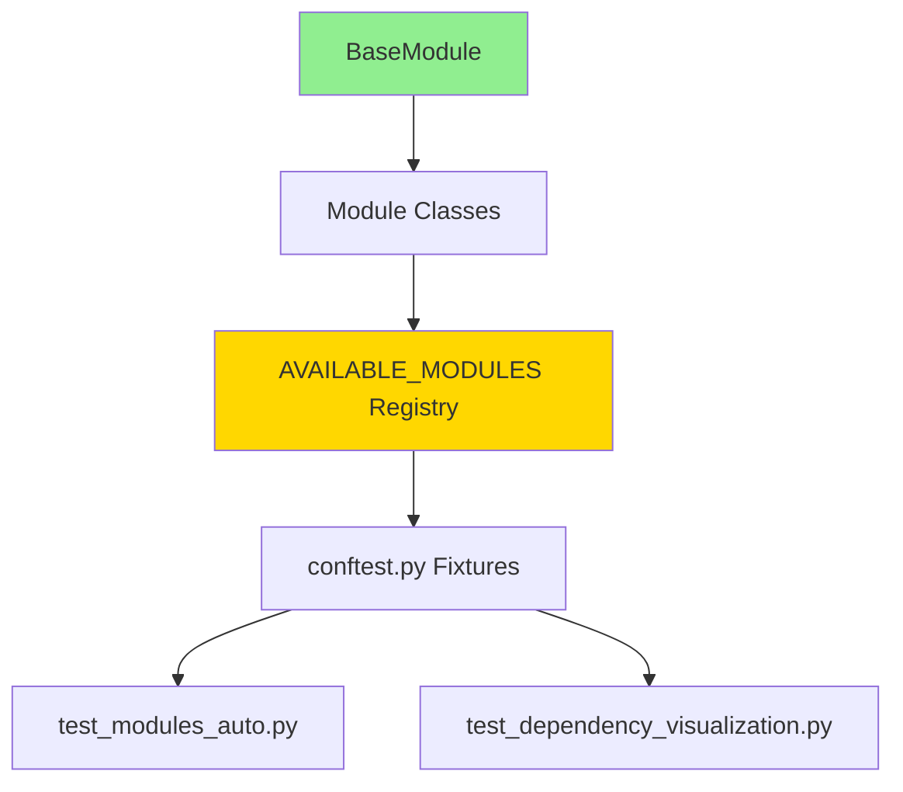

# Module Test Suite Documentation

## 📚 Table of Contents

1. [Overview](#overview)
2. [Architecture Foundation](#architecture-foundation)
3. [Test Suite Structure](#test-suite-structure)
4. [File Descriptions](#file-descriptions)
5. [BaseModule Contract](#basemodule-contract)
6. [Updating Tests When BaseModule Changes](#updating-tests-when-basemodule-changes)
7. [Running Tests](#running-tests)
8. [Troubleshooting](#troubleshooting)

---

## Overview

This test suite validates all modules that inherit from `BaseModule`. It provides:

- ✅ **Automated discovery** - All modules in `AVAILABLE_MODULES` are tested automatically
- ✅ **Real dependency execution** - Uses shared database (no mocking)
- ✅ **Comprehensive validation** - Tests creation, config loading, dependencies, execution
- ✅ **Architecture visualization** - Exports dependency graphs and analysis
- ✅ **Integration testing** - Full pipeline execution with real dependencies

---

## Architecture Foundation

### The BaseModule Contract

**Every module MUST inherit from `BaseModule` and implement:**

```python
from modules.base_module import BaseModule, ModuleResult

class YourModule(BaseModule):
    
    # REQUIRED: Unique module identifier
    @property
    def module_name(self) -> str:
        return "YourModule"
    
    # REQUIRED: Main execution logic
    def execute(self, context: Dict[str, ModuleResult]) -> ModuleResult:
        # Your logic here
        return ModuleResult(
            status='success',  # 'success' | 'failed' | 'skipped'
            data=your_data,
            message="Execution completed"
        )
    
    # OPTIONAL: Declare dependencies (default: {})
    @property
    def dependencies(self) -> Dict[str, str]:
        return {
            'OtherModule': './path/to/expected/output.json'
        }
    
    # OPTIONAL: Declare context outputs (default: [])
    @property
    def context_outputs(self) -> List[str]:
        return ['output_key1', 'output_key2']
```

### Key Principles

1. **All modules inherit from `BaseModule`** - This is mandatory
2. **Dependencies are declarative** - Via `dependencies` property
3. **Execution is standardized** - Via `execute()` and `safe_execute()`
4. **Results are uniform** - Always return `ModuleResult`
5. **Context is shared** - All modules read/write to context dict

---

## Test Suite Structure

```
tests/modules_tests/
├── conftest.py                          # Fixtures & dependency management
├── test_modules_auto.py                 # Main automated test suite
└── test_dependency_visualization.py     # Visualization & analysis
```

### Dependency Flow



---

## File Descriptions

### 1. `conftest.py` - Test Infrastructure

**Purpose**: Provides fixtures and utilities for module testing

**Key Components**:

| Component | Type | Description |
|-----------|------|-------------|
| `module_registry` | Fixture | Loads `module_registry.yaml` (session-scoped) |
| `available_modules` | Fixture | Returns `AVAILABLE_MODULES` dict |
| `ModuleDependencyGraph` | Class | Resolves execution order, detects circular deps |
| `ModuleDependencyExecutor` | Class | Executes modules with real dependencies |
| `module_fixture_factory` | Fixture | Creates module instances for testing |
| `module_context_factory` | Fixture | Gets context with dependencies executed |
| `assert_module_success` | Fixture | Helper to assert successful execution |

**Example Usage**:
```python
def test_my_module(module_fixture_factory, module_context_factory):
    # Create module instance
    module = module_fixture_factory('InitialPlanningModule')
    
    # Get context (dependencies auto-executed)
    context = module_context_factory('InitialPlanningModule')
    
    # Execute
    result = module.safe_execute(context)
    
    # Validate
    assert result.status == "success"
```

---

### 2. `test_modules_auto.py` - Main Test Suite

**Purpose**: Automatically tests all modules using pytest parametrization

#### Test Classes

##### `TestModulesAutomatically`
Tests all modules without dependencies:

- ✅ `test_module_creation` - Can instantiate
- ✅ `test_module_config_loading` - Loads YAML config
- ✅ `test_module_dependency_declaration` - Dependencies are valid dict
- ✅ `test_module_context_outputs_declaration` - Outputs are valid list
- ✅ `test_dependency_audit_when_missing` - Audits missing dependencies
- ✅ `test_module_interface_compliance` - Implements BaseModule interface

##### `TestModulesWithDependencies`
Tests modules with real dependency execution:

- ✅ `test_module_with_real_dependencies` - Dependencies execute successfully
- ✅ `test_module_execution_with_dependencies` - Full end-to-end execution

##### `TestModuleDependencyGraph`
Tests dependency graph resolution:

- ✅ `test_dependency_graph_resolution` - Correct execution order
- ✅ `test_circular_dependency_detection` - No circular dependencies

##### `TestModulesWithoutDependencies`
Tests standalone modules:

- ✅ `test_modules_without_dependencies` - Entry point modules work

##### `TestModuleFactory`
Tests factory functions from `modules/__init__.py`:

- ✅ `test_get_module_factory` - `get_module()` creates instances
- ✅ `test_get_module_invalid_name` - Errors on invalid names
- ✅ `test_list_available_modules` - `list_available_modules()` works

##### `TestModulesComprehensive`
Integration tests:

- ✅ `test_full_pipeline_execution` - All modules execute in order

---

### 3. `test_dependency_visualization.py` - Analysis & Visualization

**Purpose**: Visualize and analyze module architecture

#### Test Classes

##### `TestDependencyVisualization`
Visualize dependency relationships:

- 📊 `test_print_all_module_dependencies` - Overview of all modules
- 📊 `test_print_execution_orders` - Execution order for each module
- 📊 `test_analyze_dependency_depth` - Depth analysis (0 = entry point)
- 📊 `test_find_dependency_patterns` - Most depended-upon modules
- 📊 `test_check_for_orphan_modules` - Modules with no dependents
- 📊 `test_visualize_circular_dependencies` - Detect cycles

##### `TestDependencyIntegrity`
Validate dependency declarations:

- ✅ `test_all_dependencies_exist` - All deps point to real modules
- ✅ `test_no_self_dependencies` - No module depends on itself
- ✅ `test_dependency_types` - `dependencies` is `Dict[str, str]`
- ✅ `test_context_outputs_types` - `context_outputs` is `List[str]`

##### `TestDependencyExport`
Export graphs for documentation:

- 📤 `test_export_dependency_graph_json` - Export to JSON
- 📤 `test_export_mermaid_diagram` - Export to Mermaid diagram

##### `TestArchitectureValidation`
High-level architecture validation:

- ✅ `test_validate_architecture_principles` - Validates best practices

---

## BaseModule Contract

### Properties That Tests Depend On

| Property | Type | Default | Description | Tests That Use It |
|----------|------|---------|-------------|-------------------|
| `module_name` | `str` | **Required** | Unique module identifier | All tests |
| `dependencies` | `Dict[str, str]` | `{}` | Required modules → output paths | Dependency tests |
| `context_outputs` | `List[str]` | `[]` | Keys this module writes to context | Output validation tests |
| `config` | `Dict` | `{}` | Module configuration from YAML | Config tests |

### Methods That Tests Depend On

| Method | Returns | Description | Tests That Use It |
|--------|---------|-------------|-------------------|
| `execute(context)` | `ModuleResult` | Main execution logic | All execution tests |
| `safe_execute(context)` | `ModuleResult` | Execute with error handling | All tests |
| `load_config(path)` | `Dict` | Load YAML config | Config tests |

### ModuleResult Contract

```python
@dataclass
class ModuleResult:
    status: str              # 'success' | 'failed' | 'skipped'
    data: Any               # Module output data
    message: str            # Human-readable message
    context_updates: Dict   # Keys to add to context
    errors: List[str]       # Error messages
```

**Tests check**:
- ✅ `status` is one of: `"success"`, `"failed"`, `"skipped"`
- ✅ `message` is provided
- ✅ `context_updates` contains declared `context_outputs`

---

## Updating Tests When BaseModule Changes

### Scenario 1: Adding a New Property

**Example**: Add `priority` property to BaseModule

```python
# In BaseModule
@property
def priority(self) -> int:
    """Execution priority (lower = first)"""
    return 100
```

**Required Test Updates**:

1. **Update interface compliance test**:
```python
# test_modules_auto.py
def test_module_interface_compliance(self, module_fixture):
    # ... existing checks ...
    
    # NEW: Check priority property
    assert hasattr(module, 'priority')
    assert isinstance(module.priority, int)
    assert module.priority >= 0
```

2. **Add property validation test**:
```python
# test_modules_auto.py
@pytest.mark.parametrize('module_fixture', list(AVAILABLE_MODULES.keys()), indirect=True)
def test_module_priority_declaration(self, module_fixture):
    """Test that module declares priority correctly"""
    module_name, module_class, config_path, _ = module_fixture
    module = module_class(config_path)
    
    assert isinstance(module.priority, int), \
        f"{module_name}.priority must be int"
    assert module.priority >= 0, \
        f"{module_name}.priority must be non-negative"
```

3. **Update visualization**:
```python
# test_dependency_visualization.py
def test_print_all_module_dependencies(self, ...):
    # ... existing code ...
    
    print(f"   Priority: {module.priority}")  # NEW
```

---

### Scenario 2: Changing Property Type

**Example**: Change `dependencies` from `Dict[str, str]` to `Dict[str, Dict]`

```python
# OLD
@property
def dependencies(self) -> Dict[str, str]:
    return {'ModuleA': './path/to/output.json'}

# NEW
@property
def dependencies(self) -> Dict[str, Dict]:
    return {
        'ModuleA': {
            'output_path': './path/to/output.json',
            'optional': False
        }
    }
```

**Required Test Updates**:

1. **Update type validation**:
```python
# test_modules_auto.py
def test_module_dependency_declaration(self, module_fixture):
    # OLD
    for dep_name, dep_output in module.dependencies.items():
        assert isinstance(dep_output, str)
    
    # NEW
    for dep_name, dep_config in module.dependencies.items():
        assert isinstance(dep_name, str)
        assert isinstance(dep_config, dict)
        assert 'output_path' in dep_config
        assert isinstance(dep_config['output_path'], str)
```

2. **Update dependency graph**:
```python
# conftest.py - ModuleDependencyGraph
def get_execution_order(self, module_name: str):
    # OLD
    deps = module.dependencies
    for dep in deps:
        dfs(dep, path + [name])
    
    # NEW
    deps = module.dependencies
    for dep_name, dep_config in deps.items():
        dfs(dep_name, path + [name])
```

3. **Update all visualization tests** that access `dependencies`

---

### Scenario 3: Adding a New Required Method

**Example**: Add `validate()` method to BaseModule

```python
# In BaseModule
@abstractmethod
def validate(self) -> bool:
    """Validate module configuration"""
    pass
```

**Required Test Updates**:

1. **Update interface compliance**:
```python
# test_modules_auto.py
def test_module_interface_compliance(self, module_fixture):
    # ... existing checks ...
    
    # NEW: Check validate method
    assert hasattr(module, 'validate') and callable(module.validate), \
        f"{module_name} must implement validate() method"
```

2. **Add validation test**:
```python
@pytest.mark.parametrize('module_fixture', list(AVAILABLE_MODULES.keys()), indirect=True)
def test_module_validation(self, module_fixture):
    """Test that module validation works"""
    module_name, module_class, config_path, _ = module_fixture
    module = module_class(config_path)
    
    is_valid = module.validate()
    assert isinstance(is_valid, bool), \
        f"{module_name}.validate() must return bool"
```

---

### Scenario 4: Changing ModuleResult Structure

**Example**: Add `warnings` field to ModuleResult

```python
@dataclass
class ModuleResult:
    status: str
    data: Any
    message: str
    context_updates: Optional[Dict[str, Any]] = None
    errors: Optional[List[str]] = None
    warnings: Optional[List[str]] = None  # NEW
```

**Required Test Updates**:

1. **Update success assertion**:
```python
# conftest.py
def assert_module_success():
    def _assert(result: ModuleResult):
        assert isinstance(result, ModuleResult)
        assert result.status == "success"
        
        # NEW: Check warnings don't prevent success
        if result.warnings:
            assert isinstance(result.warnings, list)
```

2. **Update result validation**:
```python
# test_modules_auto.py
def test_module_execution_with_dependencies(self, ...):
    result = module.safe_execute(context)
    
    # NEW: Log warnings
    if result.warnings:
        print(f"⚠️  Warnings: {result.warnings}")
```

---

### Scenario 5: Changing Execution Model

**Example**: Change from `execute(context)` to `execute(context, config)`

```python
# OLD
def execute(self, context: Dict[str, ModuleResult]) -> ModuleResult:
    pass

# NEW
def execute(self, context: Dict[str, ModuleResult], 
           runtime_config: Dict = None) -> ModuleResult:
    pass
```

**Required Test Updates**:

1. **Update all execution calls**:
```python
# test_modules_auto.py - ALL tests that call execute/safe_execute

# OLD
result = module.safe_execute(context)

# NEW
result = module.safe_execute(context, runtime_config=None)
```

2. **Update dependency executor**:
```python
# conftest.py - ModuleDependencyExecutor
def _execute_single_module(self, module_name, context):
    # OLD
    result = module.safe_execute(context)
    
    # NEW
    runtime_config = self._get_runtime_config(module_name)
    result = module.safe_execute(context, runtime_config)
```

---

## Running Tests

### Run All Module Tests
```bash
pytest tests/modules_tests/ -v
```

### Run by Test Class
```bash
# Smoke tests only
pytest tests/modules_tests/ -m smoke -v

# Tests without dependencies (fast)
pytest tests/modules_tests/ -m no_dependencies -v

# Tests with dependencies (slower)
pytest tests/modules_tests/ -m requires_dependencies -v

# Integration tests (full pipeline)
pytest tests/modules_tests/ -m integration -v
```

### Run Specific Test File
```bash
# Main test suite
pytest tests/modules_tests/test_modules_auto.py -v

# Visualization tests
pytest tests/modules_tests/test_dependency_visualization.py -v -s
```

### Run for Specific Module
```bash
pytest tests/modules_tests/ -k "DataPipelineModule" -v
```

### Debug Mode
```bash
# Show print statements
pytest tests/modules_tests/ -v -s

# Stop on first failure
pytest tests/modules_tests/ -x

# Show local variables on failure
pytest tests/modules_tests/ -l
```

### Generate Coverage Report
```bash
pytest tests/modules_tests/ --cov=modules --cov-report=html
```

---

## Troubleshooting

### Common Issues

#### Issue 1: Module Not Found in Registry

**Error**: `pytest.skip.Exception: Module X not in registry`

**Solution**: Add module to `configs/module_registry.yaml`:
```yaml
YourModule:
  enabled: true
  config_path: "configs/modules/your_module_config.yaml"
```

---

#### Issue 2: Circular Dependency Detected

**Error**: `ValueError: Circular dependency detected: A → B → C → A`

**Solution**: 
1. Check dependency declarations in affected modules
2. Redesign to break the cycle (extract common dependency)

---

#### Issue 3: Missing Dependency Output

**Error**: `AssertionError: Missing declared output 'X' in context_updates`

**Solution**: Ensure module's `execute()` adds declared outputs:
```python
def execute(self, context):
    result = ModuleResult(
        status='success',
        data=data,
        message="Done",
        context_updates={
            'output_key': value  # Must match context_outputs
        }
    )
    return result
```

---

#### Issue 4: Type Validation Failed

**Error**: `AssertionError: dependencies must be dict, got list`

**Solution**: Check property returns correct type:
```python
@property
def dependencies(self) -> Dict[str, str]:
    return {}  # Not []
```

---

## Best Practices

### When Adding a New Module

1. ✅ Inherit from `BaseModule`
2. ✅ Implement all required methods/properties
3. ✅ Add to `AVAILABLE_MODULES` in `modules/__init__.py`
4. ✅ Add to `configs/module_registry.yaml`
5. ✅ Run tests: `pytest tests/modules_tests/ -k "YourModule"`

### When Modifying BaseModule

1. ✅ Update this documentation
2. ✅ Update test expectations in affected files
3. ✅ Run full test suite: `pytest tests/modules_tests/ -v`
4. ✅ Update all existing modules to comply
5. ✅ Update visualization tests if needed

### When Debugging Failures

1. 🔍 Run with `-s` to see print output
2. 🔍 Use `print_dependency_graph` fixture
3. 🔍 Check `test_dependency_visualization.py` output
4. 🔍 Verify module implements BaseModule correctly
5. 🔍 Check `module_registry.yaml` configuration

---

## Quick Reference

### Test Markers
| Marker | Description |
|--------|-------------|
| `@pytest.mark.smoke` | Fast validation tests |
| `@pytest.mark.no_dependencies` | Tests without dependency execution |
| `@pytest.mark.requires_dependencies` | Tests that execute real dependencies |
| `@pytest.mark.integration` | Full pipeline tests |

### Key Fixtures
| Fixture | Returns | Scope |
|---------|---------|-------|
| `module_fixture_factory` | Module instance | Function |
| `module_context_factory` | Context with dependencies | Function |
| `module_dependency_graph` | Dependency analyzer | Session |
| `module_dependency_executor` | Executor with cache | Session |
| `assert_module_success` | Assertion helper | Function |

### Important Files
| File | Purpose |
|------|---------|
| `modules/base_module.py` | Foundation class |
| `modules/__init__.py` | Module registry |
| `configs/module_registry.yaml` | Module configuration |
| `tests/modules_tests/conftest.py` | Test fixtures |
| `tests/modules_tests/test_modules_auto.py` | Main tests |
| `tests/modules_tests/test_dependency_visualization.py` | Analysis |

---

## Appendix: Test Coverage Matrix

| BaseModule Feature | Test Coverage |
|-------------------|---------------|
| Module instantiation | ✅ `test_module_creation` |
| Config loading | ✅ `test_module_config_loading` |
| `module_name` property | ✅ `test_module_interface_compliance` |
| `dependencies` property | ✅ `test_module_dependency_declaration` |
| `context_outputs` property | ✅ `test_module_context_outputs_declaration` |
| `execute()` method | ✅ `test_module_execution_with_dependencies` |
| `safe_execute()` method | ✅ All execution tests |
| Dependency resolution | ✅ `test_dependency_graph_resolution` |
| Circular dependency detection | ✅ `test_circular_dependency_detection` |
| Missing dependency audit | ✅ `test_dependency_audit_when_missing` |
| BaseModule inheritance | ✅ `test_module_interface_compliance` |
| Factory functions | ✅ `TestModuleFactory` class |

---

**Last Updated**: January 2026  
**Maintained By**: Development Team  
**Related Docs**: `modules/base_module.py`, `docs/architecture.md`