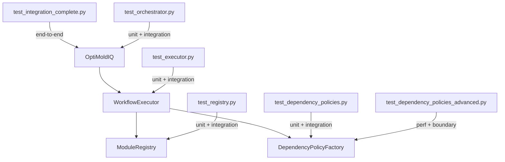

# Workflow Test Suite Documentation

## 📚 Table of Contents

1. [Overview](#overview)
2. [Test Suite Structure](#test-suite-structure)
3. [File Descriptions](#file-descriptions)
4. [Running Tests](#running-tests)
5. [Test Coverage](#test-coverage)

---

## Overview

This test suite validates the entire workflow layer: dependency policies, executor, registry, and orchestrator. Unlike the module tests which use real database execution, workflow tests rely on **mocks and fixtures** — module instances are mocked so tests focus on orchestration logic, not business logic.

- **177 tests, 2.37s** — fast by design, no real I/O except filesystem policy tests
- **99% coverage** across 344 statements
- Tests are organized by component, each file tests one layer of the stack

### Current Test Results

```
================================ tests coverage ================================
Name                                        Stmts   Miss  Cover   Missing
-------------------------------------------------------------------------
workflows/__init__.py                           0      0   100%
workflows/dependency_policies/__init__.py      33      0   100%
workflows/dependency_policies/base.py          62      1    98%   96
workflows/dependency_policies/factory.py       50      4    92%   60-61, 86-87
workflows/dependency_policies/flexible.py      41      0   100%
workflows/dependency_policies/hybrid.py        29      0   100%
workflows/dependency_policies/strict.py        13      0   100%
workflows/executor.py                          79      0   100%
workflows/registry/registry.py                 37      0   100%
-------------------------------------------------------------------------
TOTAL                                         344      5    99%
============================= 177 passed in 2.37s ==============================
```

---

## Test Suite Structure

```
tests/workflows_tests/
├── test_dependency_policies.py          # Core policy tests (unit + integration)
├── test_dependency_policies_advanced.py # Performance, boundary, comparison tests
├── test_executor.py                     # WorkflowExecutor tests
├── test_orchestrator.py                 # OptiMoldIQ tests
├── test_registry.py                     # ModuleRegistry tests
└── test_integration_complete.py         # End-to-end integration tests
```

### Layer Coverage



---

## File Descriptions

### 1. `test_dependency_policies.py` — Core Policy Tests

Tests policy behavior, factory, and schema validation. Uses `tmp_path` for real filesystem checks (age-based tests require real files with real `mtime`).

#### Fixtures

| Fixture | Returns | Description |
|---|---|---|
| `sample_dependencies` | `Dict[str, str]` | 3-entry dep map (mesh, material, config) |
| `workflow_modules` | `List[str]` | 2-element workflow module list |
| `mock_filesystem` | `Dict[str, str]` | Creates `recent` (1d), `old` (10d), and `missing` files in `tmp_path` |

#### `TestDependencyValidationResult`

| Test | What it checks |
|---|---|
| `test_empty_result_is_valid` | `valid=True`, no errors/warnings, `should_block()=False` |
| `test_result_with_errors_is_invalid` | `valid=False`, `has_errors()=True`, `should_block()=True` |
| `test_result_with_warnings_only_is_valid` | Warnings don't block execution |
| `test_summary` | `summary()` returns correct dict structure with enum values as strings |

#### `TestDependencyIssue`

| Test | What it checks |
|---|---|
| `test_to_dict` | All fields serialized correctly, enums become strings |

#### `TestStrictWorkflowPolicy`

| Test | What it checks |
|---|---|
| `test_all_dependencies_in_workflow` | All resolved, source = `WORKFLOW` |
| `test_missing_dependency_causes_error` | Dep not in workflow → `WORKFLOW_VIOLATION` |
| `test_empty_workflow_all_errors` | Empty workflow → all deps in errors |
| `test_no_dependencies` | Empty deps dict → valid, nothing resolved |

#### `TestFlexibleDependencyPolicy`

| Test | What it checks |
|---|---|
| `test_no_required_deps_all_optional` | Missing dep → warning (not error) |
| `test_required_dep_found_in_workflow` | Workflow source preferred over DB |
| `test_required_dep_missing_causes_error` | Required dep missing → error |
| `test_age_constraint_required_dep` | Old required dep → `TOO_OLD` error |
| `test_age_constraint_optional_dep` | Old optional dep → `TOO_OLD` warning |
| `test_recent_file_passes_age_check` | Recent file → resolved, source = `DATABASE` |
| `test_mixed_required_and_optional` | Required found + optional missing → valid |

#### `TestHybridDependencyPolicy`

| Test | What it checks |
|---|---|
| `test_workflow_preferred_no_fallback` | Workflow source → no warnings |
| `test_fallback_to_database_with_warning` | DB fallback + `prefer_workflow=True` → warning with `WORKFLOW_VIOLATION` reason |
| `test_fallback_to_database_no_warning` | DB fallback + `prefer_workflow=False` → no warnings |
| `test_database_not_found_error` | Not found anywhere → `NOT_FOUND` error, `required=True` |
| `test_age_constraint_blocks_old_data` | Old DB file → `TOO_OLD` error |
| `test_recent_data_passes_age_check` | Recent DB file → resolved |
| `test_workflow_bypasses_age_check` | Dep in workflow bypasses `max_age_days` |

#### `TestDependencyPolicyFactory`

| Test | What it checks |
|---|---|
| `test_create_from_string_*` | String shorthand creates correct class |
| `test_create_from_string_invalid` | Unknown name → `ValueError` |
| `test_create_from_dict_flexible_with_params` | Params passed to constructor, `required_deps` becomes `set` |
| `test_create_from_dict_hybrid_with_params` | `max_age_days`, `prefer_workflow` correctly set |
| `test_create_from_dict_missing_name` | No `name` key → `ValueError` |
| `test_create_from_dict_invalid_params` | Unknown params → `ValueError` |
| `test_create_none_returns_none` | `None` input → `None` output |
| `test_create_invalid_type` | `int` input → `TypeError` |
| `test_get_schema` | Returns `description`, `required_params`, `optional_params`, `defaults` |
| `test_list_policies` | Returns dict of all 3 policies with string descriptions |

#### `TestPolicySchema`

| Test | What it checks |
|---|---|
| `test_validate_params_success` | Valid params → `valid=True`, no errors/warnings |
| `test_validate_params_missing_required` | Missing required param → error mentioning param name |
| `test_validate_params_unknown_params` | Extra unknown param → `"Unknown parameters"` error |
| `test_validate_params_type_warning` | Wrong type → warning (not error), `valid=True` |
| `test_get_defaults` | Only params with `default` key are returned |

#### `TestPolicyIntegration`

| Test | What it checks |
|---|---|
| `test_strict_policy_workflow_execution` | 3-module workflow all in deps → all resolved |
| `test_flexible_policy_partial_workflow` | Required found + optional old/missing → valid with warnings |
| `test_hybrid_policy_progressive_fallback` | workflow → DB recent → DB old (error) → missing (error) |

#### `TestEdgeCases`

| Test | What it checks |
|---|---|
| `test_empty_dependencies` | All 3 policies handle `{}` gracefully |
| `test_none_workflow_modules` | `workflow_modules=None` doesn't crash any policy |
| `test_special_characters_in_paths` | Paths with spaces/dashes → returns `DependencyValidationResult` |
| `test_filesystem_error_handling` | `PermissionError` from `Path.exists` → dep in errors |

---

### 2. `test_dependency_policies_advanced.py` — Advanced Policy Tests

Extends the core tests with performance, concurrency, boundary values, and cross-policy comparisons. All filesystem tests use `tmp_path` and `os.utime()` for precise age control.

#### `TestPerformance`

| Test | What it checks |
|---|---|
| `test_strict_policy_large_workflow` | 1000 deps in workflow → all resolved in < 1s |
| `test_flexible_policy_large_mixed` | 500 real files → completes in < 5s |
| `test_hybrid_policy_repeated_validation` | 10 repeated validations of 100 files → avg < 1s each |

#### `TestConcurrency`

| Test | What it checks |
|---|---|
| `test_multiple_policies_different_configs` | 3 `FlexibleDependencyPolicy` instances maintain independent state |

#### `TestComplexScenarios`

| Test | What it checks |
|---|---|
| `test_circular_dependency_names` | Names referencing each other (not actual cycles) → all resolved |
| `test_deeply_nested_paths` | 6-level deep path → resolves correctly |
| `test_unicode_paths_and_names` | Chinese characters in dep name and path → resolves |
| `test_case_sensitive_dependency_names` | `MeshData` ≠ `meshdata` ≠ `MESHDATA` — only exact match resolves |

#### `TestMetadataAndLogging`

| Test | What it checks |
|---|---|
| `test_error_metadata_contains_details` | `error.metadata` has `age_days`, `max_age_days`, `last_modified` |
| `test_workflow_violation_metadata` | Strict error metadata has `workflow_modules` list |
| `test_logging_behavior` | Policy logger emits warning/info on missing required dep |

#### `TestFactoryAdvanced`

| Test | What it checks |
|---|---|
| `test_factory_with_empty_params` | `params: {}` → defaults applied, no error |
| `test_factory_defaults_applied` | String creation → `FlexibleDependencyPolicy` with correct defaults |
| `test_factory_validation_warnings_logged` | Wrong type for param → warning logged, policy created |
| `test_factory_multiple_policies_from_configs` | Batch creation of all 3 policy types with params |

#### `TestBoundaryValues`

| Test | What it checks |
|---|---|
| `test_age_exactly_at_limit` | File exactly `max_age_days` old → passes (not `>`, just `>=`) |
| `test_age_one_second_over_limit` | 31 days with limit=30 → `TOO_OLD` error |
| `test_zero_age_limit` | `max_age_days=0`, brand new file → passes |
| `test_very_large_age_limit` | `max_age_days=36500` → passes for any file |
| `test_empty_string_dependency_name` | `""` as dep name in workflow → resolved |

#### `TestErrorRecovery`

| Test | What it checks |
|---|---|
| `test_partial_filesystem_failure` | Good + bad path → good resolved, bad in errors |
| `test_policy_continues_after_errors` | 1 missing + 2 found → missing in errors, others resolved |

#### `TestPolicyComparisons`

| Test | What it checks |
|---|---|
| `test_same_deps_different_policies` | Same dep, all 3 policies: strict fails, flexible passes (optional), hybrid passes |
| `test_strictness_ordering` | strict=invalid, hybrid=valid+warning, flexible=valid+no warnings |

---

### 3. `test_executor.py` — WorkflowExecutor Tests

Tests the execution engine in isolation. `ModuleRegistry` is fully mocked — no real modules are instantiated. Workflow JSON files are created in `tmp_path`.

#### Fixtures

| Fixture | Scope | Returns | Description |
|---|---|---|---|
| `mock_registry` | function | `Mock` | Mocked `ModuleRegistry` |
| `workflows_dir` | function | `str` | Temp dir for workflow JSONs |
| `sample_workflow_dict` | function | `dict` | 2-module workflow with mixed policies |
| `executor` | function | `WorkflowExecutor` | Executor with mock registry and temp dir |
| `create_workflow_file` | function | `Callable` | Writes JSON file to `workflows_dir` |
| `mock_module_instance` | function | `Mock` | Module that returns `status=success` |

#### `TestWorkflowExecutorResult`

| Test | What it checks |
|---|---|
| `test_result_initialization` | Defaults: `results={}`, `execution_context={}` |
| `test_is_success/failed/skipped` | Status helper methods mutually exclusive |
| `test_with_results_and_context` | Optional fields stored correctly |

#### `TestWorkflowLoading`

| Test | What it checks |
|---|---|
| `test_load_workflow_success` | JSON parsed correctly from file |
| `test_load_workflow_not_found` | Missing file → `FileNotFoundError` |
| `test_get_workflow_info` | Returns full workflow dict |
| `test_load_workflow_invalid_json` | Malformed JSON → `json.JSONDecodeError` |

#### `TestDependencyValidation`

| Test | What it checks |
|---|---|
| `test_validate_dependencies_with_strict_policy` | Dep in workflow → resolved |
| `test_validate_dependencies_missing_dependency` | Dep not in requested_modules → error |
| `test_validate_dependencies_default_strict_policy` | `policy=None` → defaults to `StrictWorkflowPolicy` |
| `test_validate_dependencies_flexible_policy` | Flexible allows filesystem dep not in workflow |

#### `TestModuleExecution`

| Test | What it checks |
|---|---|
| `test_execute_single_module_success` | Success result in `results` dict |
| `test_execute_module_with_config` | `config_file` passed to `registry.get_module_instance()` |
| `test_execute_required_module_failure_stops_workflow` | `required=True` + failed → workflow stops, second module never runs |
| `test_execute_optional_module_failure_continues` | `required=False` + failed → workflow continues, both modules in results |
| `test_execute_module_dependency_validation_failure` | Dep validation fails, `required=False` → module `status=skipped` |
| `test_execute_required_module_dependency_failure_stops` | Dep validation fails, `required=True` → workflow `status=failed` |

#### `TestExecutionCache`

| Test | What it checks |
|---|---|
| `test_module_executed_once_with_cache` | Same module twice in workflow → `get_module_instance` called once |
| `test_cache_persists_across_workflow_executions` | Two calls to `executor.execute()` → `safe_execute` called once total |
| `test_cache_stores_module_results` | `executor._execution_cache[name]` holds the `ModuleResult` |

#### `TestWorkflowExecution`

| Test | What it checks |
|---|---|
| `test_execute_empty_workflow` | `modules: []` → success, 0 results |
| `test_execute_multi_module_workflow` | 3 modules → all in results |
| `test_execute_workflow_generates_execution_id` | Two runs → different 8-char hex IDs |
| `test_execute_workflow_with_mixed_policies` | Strict + flexible per module, both succeed |

#### `TestResponseBuilder`

| Test | What it checks |
|---|---|
| `test_build_response_success` | Result dict has correct structure per module |
| `test_build_response_with_execution_context` | `cached_modules` and `total_modules` in context |
| `test_build_response_with_errors` | Module errors list preserved in response |

#### `TestExecutorIntegration`

| Test | What it checks |
|---|---|
| `test_complete_workflow_execution_flow` | 3-module pipeline: flexible → strict → hybrid, verify call args |

#### `TestErrorHandling`

| Test | What it checks |
|---|---|
| `test_module_instantiation_failure` | Registry raises `ValueError` → propagates |
| `test_module_execution_exception` | `safe_execute` raises `RuntimeError` → propagates |
| `test_invalid_dependency_policy_config` | Invalid policy params → `ValueError` from factory |

#### `TestEdgeCases`

| Test | What it checks |
|---|---|
| `test_workflow_with_no_modules_field` | Missing `modules` key → `KeyError` |
| `test_module_with_none_config` | `config_file: null` → `get_module_instance(name, None)` |
| `test_module_with_empty_dependencies` | `dependencies={}` + strict → success |

---

### 4. `test_orchestrator.py` — OptiMoldIQ Tests

Tests the top-level orchestrator. `WorkflowExecutor` is patched at the class level so executor behavior is fully controlled. Workflow JSON files are created in `tmp_path`.

#### Fixtures

| Fixture | Scope | Returns | Description |
|---|---|---|---|
| `mock_module_registry` | function | `Mock(spec=ModuleRegistry)` | Registry with 3 mock modules |
| `workflows_dir` | function | `Path` | Temp directory |
| `create_workflow_file` | function | `Callable` | Writes JSON to workflows_dir |
| `sample_workflows` | function | `dict` | Creates 3 workflow files (workflow1/2/3) |
| `orchestrator` | function | `OptiMoldIQ` | Empty orchestrator (no workflows) |
| `orchestrator_with_workflows` | function | `OptiMoldIQ` | Orchestrator with 3 pre-loaded workflows |

#### `TestOrchestratorInitialization`

| Test | What it checks |
|---|---|
| `test_initialization_with_valid_workflows` | 3 workflows discovered, paths stored |
| `test_initialization_with_empty_directory` | Empty dir → 0 workflows, empty executor cache |
| `test_initialization_creates_empty_executor_cache` | `_executors == {}` on init |

#### `TestWorkflowDiscovery`

| Test | What it checks |
|---|---|
| `test_discover_all_valid_workflows` | All paths are `.json` `Path` objects |
| `test_discover_workflows_ignores_non_json` | `.txt` and `.yaml` files ignored |
| `test_discover_workflows_handles_invalid_json` | Invalid JSON → skipped + error logged, valid ones still loaded |
| `test_discover_workflows_with_subdirectories` | Only top-level JSON files discovered (no recursion) |

#### `TestWorkflowValidation`

| Test | What it checks |
|---|---|
| `test_validate_workflow_missing_modules_field` | No `modules` key → `ValueError` |
| `test_validate_workflow_module_missing_name` | Module entry without `module` key → `ValueError` |
| `test_validate_workflow_invalid_dependency_policy` | Invalid policy params → `ValueError` at init |
| `test_validate_workflow_unknown_policy_name` | Unknown policy string → `ValueError` at init |
| `test_validate_valid_workflow` | Valid definition → no exception |
| `test_validate_workflow_multiple_errors` | Multiple issues → single error with all messages |

#### `TestWorkflowListing`

| Test | What it checks |
|---|---|
| `test_list_workflows` | Returns list of 3 names |
| `test_list_workflows_empty` | Empty dir → empty list |
| `test_get_workflow_info` | Returns full workflow dict |
| `test_get_workflow_info_not_found` | Unknown name → `ValueError` with "not found" |

#### `TestExecutorManagement`

| Test | What it checks |
|---|---|
| `test_get_or_create_executor_creates_new` | Returns `WorkflowExecutor`, cached in `_executors` |
| `test_get_or_create_executor_reuses_cached` | Two calls → same object, still 1 entry |
| `test_get_or_create_executor_different_workflows` | Different names → different objects, 2 entries |
| `test_get_or_create_executor_not_found` | Unknown workflow → `ValueError` |

#### `TestWorkflowExecution`

| Test | What it checks |
|---|---|
| `test_execute_workflow_success` | `executor.execute()` called with correct name |
| `test_execute_workflow_not_found` | Unknown name → `ValueError` |
| `test_execute_workflow_with_clear_cache` | `clear_cache=True` → `_execution_cache.clear()` called |
| `test_execute_workflow_without_clear_cache` | `clear_cache=False` → cache not cleared |
| `test_execute_reuses_cached_executor` | Two executions → `WorkflowExecutor` constructed once, `execute()` called twice |

#### `TestWorkflowChaining`

| Test | What it checks |
|---|---|
| `test_execute_chain_success` | All 3 workflows succeed → 3 results |
| `test_execute_chain_stops_on_failure` | Workflow 2 fails + `stop_on_failure=True` → only 2 results |
| `test_execute_chain_continues_on_failure` | Workflow 2 fails + `stop_on_failure=False` → all 3 results |
| `test_execute_chain_empty_list` | `[]` → empty dict, no error |
| `test_execute_chain_single_workflow` | Single-item chain works correctly |

#### `TestCacheManagement`

| Test | What it checks |
|---|---|
| `test_clear_all_caches` | Two executors → both caches cleared |
| `test_clear_all_caches_no_executors` | No executors → no error |
| `test_get_cache_stats` | Returns `{workflow_name: cache_size}` |
| `test_get_cache_stats_empty` | No executors → empty dict |

#### `TestOrchestratorIntegration`

| Test | What it checks |
|---|---|
| `test_complete_orchestration_flow` | Discover → validate → list → get_info |
| `test_orchestrator_with_invalid_and_valid_workflows` | Mix of valid, invalid JSON, corrupt JSON → only valid loaded |

#### `TestErrorHandling` / `TestEdgeCases`

| Test | What it checks |
|---|---|
| `test_workflows_dir_not_exists` | Non-existent dir → 0 workflows, no crash |
| `test_workflow_file_read_permission_error` | `PermissionError` on open → handled gracefully |
| `test_workflow_with_unicode_name` | Chinese filename → discovered correctly |
| `test_workflow_with_very_long_name` | 200-char filename → discovered correctly |
| `test_multiple_orchestrators_same_workflows_dir` | Same dir, 2 instances → same workflows, separate executor caches |

---

### 5. `test_registry.py` — ModuleRegistry Tests

Tests registry initialization, module instantiation, and listing. `modules_package.AVAILABLE_MODULES` and `modules_package.get_module` are patched for isolation.

#### Fixtures

| Fixture | Returns | Description |
|---|---|---|
| `registry_file` | `str` | Path to temp YAML file |
| `sample_registry_data` | `dict` | 3-module registry (2 enabled, 1 disabled) |
| `create_registry_file` | `Callable` | Writes YAML and returns path |
| `mock_available_modules` | `dict` | 4 mock module classes |

#### `TestRegistryInitialization`

| Test | What it checks |
|---|---|
| `test_initialization_with_valid_registry` | Loads 3 entries from YAML |
| `test_initialization_registry_not_found` | Missing file → empty registry, warning logged |
| `test_initialization_empty_registry_file` | Empty file → `module_registry == {}` |
| `test_initialization_invalid_yaml` | Malformed YAML → `yaml.YAMLError` |

#### `TestGetModuleInstance`

| Test | What it checks |
|---|---|
| `test_get_module_instance_with_override_config` | Override takes priority over registry `config_path` |
| `test_get_module_instance_with_registry_config` | No override → uses `config_path` from YAML |
| `test_get_module_instance_no_config` | No `config_path` in YAML → `module_class(None)` |
| `test_get_module_instance_not_available` | Not in `AVAILABLE_MODULES` → `ValueError` |
| `test_get_module_instance_not_in_registry` | In `AVAILABLE_MODULES` but not in YAML → `module_class(None)` |

#### `TestListModules`

| Test | What it checks |
|---|---|
| `test_list_modules_all` | Returns all 4 from `AVAILABLE_MODULES` |
| `test_list_modules_enabled_only` | Returns only 2 enabled from YAML |
| `test_list_modules_empty_registry` | No YAML → all from `AVAILABLE_MODULES`; `enabled_only` → empty |

#### `TestGetModuleInfo`

| Test | What it checks |
|---|---|
| `test_get_module_info_exists` | Returns full YAML dict including custom fields |
| `test_get_module_info_not_in_registry` | Available but no YAML entry → `{}` |
| `test_get_module_info_not_available` | Not in `AVAILABLE_MODULES` → `ValueError` |

#### `TestRegistryIntegration`

| Test | What it checks |
|---|---|
| `test_complete_registry_workflow` | list → enabled → get_instance → get_info, including custom `priority` field |

#### `TestEdgeCases`

| Test | What it checks |
|---|---|
| `test_registry_with_unicode_paths` | Chinese characters in `config_path` stored correctly |
| `test_registry_with_special_characters` | `@#$%` in paths and descriptions |
| `test_registry_with_null_values` | `config_path: null` stored and returned as `None` |

---

### 6. `test_integration_complete.py` — End-to-End Integration Tests

Tests the full stack from registry → executor → orchestrator with real file I/O. Uses `@patch` on `modules.AVAILABLE_MODULES` and `modules.get_module` to inject lightweight mock module classes (not `Mock()` objects — actual classes with `__init__` and `safe_execute`).

#### `TestCompleteIntegration`

| Test | What it checks |
|---|---|
| `test_end_to_end_workflow_execution` | Full stack: real YAML registry + real JSON workflow + mock modules → success |
| `test_workflow_chain_execution` | Two workflows chained → both succeed |
| `test_workflow_with_failed_required_module` | Module3 always fails + `required=True` → workflow failed |

#### `TestDependencyPolicyIntegration`

| Test | What it checks |
|---|---|
| `test_strict_policy_blocks_missing_dependencies` | Module2 needs Module1 which isn't in workflow → skipped |
| `test_flexible_policy_allows_execution` | Dep is a real file → flexible resolves from filesystem → success |

#### `TestCacheIntegration`

| Test | What it checks |
|---|---|
| `test_cache_persists_within_workflow` | Same module twice in workflow → `safe_execute` called once |
| `test_cache_cleared_between_executions` | First run `clear_cache=False`, second `clear_cache=True` → executed twice total |

#### `TestErrorPropagation`

| Test | What it checks |
|---|---|
| `test_module_error_propagates_correctly` | `errors=["Intentional failure"]` visible in `result.results["Module3"]["errors"]` |

---

## Running Tests

```bash
# Full test suite
pytest tests/workflows_tests/ -v

# Single file
pytest tests/workflows_tests/test_dependency_policies.py -v
pytest tests/workflows_tests/test_executor.py -v
pytest tests/workflows_tests/test_orchestrator.py -v
pytest tests/workflows_tests/test_registry.py -v
pytest tests/workflows_tests/test_integration_complete.py -v

# Advanced/performance tests
pytest tests/workflows_tests/test_dependency_policies_advanced.py -v

# With coverage
pytest tests/workflows_tests/ --cov=workflows --cov-report=term-missing

# Stop on first failure
pytest tests/workflows_tests/ -x

# Specific test class or function
pytest tests/workflows_tests/test_executor.py::TestExecutionCache -v
pytest tests/workflows_tests/ -k "test_workflow_bypasses_age_check" -v
```

---

## Test Coverage

### Current: 99% (344 stmts, 5 missed)

| File | Coverage | Missing |
|---|---|---|
| `dependency_policies/__init__.py` | 100% | — |
| `dependency_policies/flexible.py` | 100% | — |
| `dependency_policies/hybrid.py` | 100% | — |
| `dependency_policies/strict.py` | 100% | — |
| `executor.py` | 100% | — |
| `registry/registry.py` | 100% | — |
| `dependency_policies/base.py` | 98% | line 96 |
| `dependency_policies/factory.py` | 92% | lines 60-61, 86-87 |

### Remaining gaps

**`base.py` line 96** — inside `_check_in_database()`, the `except Exception` handler. Triggered only by unexpected errors from `path.stat()` beyond `PermissionError` (e.g. OS-level errors). Negligible risk.

**`factory.py` lines 60-61, 86-87** — lines 60-61 are the `logger.warning` call for type mismatch warnings; lines 86-87 are the `except TypeError` handler in `_create_from_dict()` that catches when a policy constructor rejects its arguments despite passing schema validation. Both are defensive paths that require unusual runtime conditions to trigger.

---

**Document Version**: 1.0
**Last Updated**: February 2026
**Test Framework**: pytest 7.x
**Python Version**: 3.11+